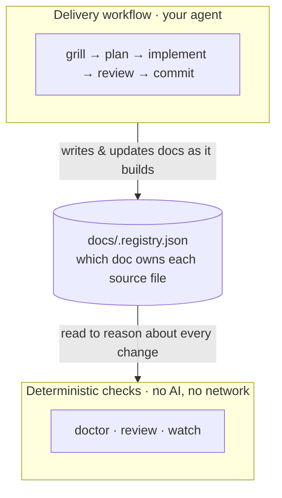
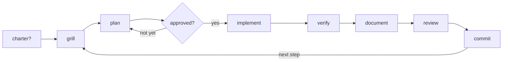

# codument

A deterministic, git-native change-control safety layer for AI-made changes — plus the docs-backed delivery workflow that produces them.

[](LICENSE)

<p align="center">
  
</p>

<p align="center"><sub><code>codument watch</code> · estimated from captured token usage · facts, not a bill</sub></p>

## What it is

Codument has **two sides** that work together:

- **A delivery workflow your agent runs.** Docs-backed planning, source-to-doc ownership, review discipline, and commit hygiene. You just chat; your agent routes intent into the right phase from the installed instructions. Core loop: `grill → plan → approve → implement → verify → document → review → commit`.
- **Deterministic CLI checks you run.** Local, no-network, no-AI commands that read the repo and report the facts: `doctor` (coverage + lint), `review` (what a change touched, what went stale), `watch` (a live view). Same repo state → same output.

The link between them is **`docs/.registry.json`** — a v2 registry mapping each source file to the feature/doc that owns it. The workflow writes it as it builds; the checks read it to reason about every change.



## How you run it

codument is two tools used in two places — keeping them straight is the whole trick:

| Where | What it's for | Examples |
| --- | --- | --- |
| 🖥️ **Your terminal** (you type) | setup, the deterministic checks, upgrades | `codument init`/`scan`/`adopt` · `codument doctor`/`review`/`watch` · `codument update` |
| 💬 **Your agent** (you just chat) | the delivery workflow and the fixes | `grill → … → commit` · `/update-docs` · `/review-work` |

**Rule of thumb: the CLI finds and reports; your agent fixes.** Codument never writes your code or docs.

The flow, start to finish:

```text
1. Set up    terminal · once      npm i -D codument  →  codument init | scan | adopt
2. Build     agent · ongoing      just chat: grill → plan → implement → review → commit
3. Check     terminal · anytime   codument doctor | review | watch
4. Fix       agent                /update-docs … your agent clears what the checks found
5. Upgrade   terminal · rare      codument update   (after bumping the package)
```

## Try it in 30 seconds

One command runs a click-through showcase on a throwaway sample repo — your docs today → an AI makes a sweeping change → exactly what that change broke that you'd otherwise merge blind, opened as an HTML report. Press Enter to advance each scene (or add `--auto`).

```bash
npx codument demo
```

Or watch it happen live in a single terminal — the change-state panel starts clean, then the AI change lands and the counts light up in place:

```bash
npx codument demo --live
```

(From a checkout of this repo: `npm run demo` or `npm run demo:live`.)

## 1 · Set up — terminal, once

```bash
npm install -D codument
```

Then run **one** of these, matching your project:

### New project → `init`

```bash
npx codument init
```

Installs the Claude profile by default:

- `AGENTS.md` and `CLAUDE.md` with the shared delivery workflow
- `.claude/skills/` with the core workflow skills
- `.claude/agents/`, `.claude/rules/`, and `.claude/settings.json` for Claude-specific subagents, rules, and the documentation hook
- `docs/` with feature, concept, guide, and ADR structure
- `docs/.registry.json` mapping source files to docs
- `.codument-meta.json` recording installed agent profiles

Pick profiles explicitly with `--agents claude`, `--agents codex`, or `--agents codex,claude`. The Codex/generic profile writes `AGENTS.md` and `.agents/skills/` only — portable across any agent that reads `AGENTS.md`.

### Existing code, no docs yet → `scan`

```bash
npx codument scan
```

Groups source files into feature and concept docs, creates scaffolds, and populates `docs/.registry.json`. New entries are marked `needs-review`; run `/update-docs` (the agent) to fill them with real content.

### Existing Codument project (upgrade or migrate) → `adopt`

```bash
npx codument adopt --dry-run --agents codex,claude
npx codument adopt --agents codex,claude
```

Use `adopt` when a project already has Codument docs, an older `.codument-meta.json`, or a legacy registry (the flat `sources` or old `mappings` shape). It migrates the registry into the **v2** ownership shape (`primary_sources`, `related_sources`, `docs`, `depends_on`, `risk`), keeps the old one as `docs/.registry.backup.json`, refreshes `.codument-meta.json`, and installs/updates the selected agent profiles.

To convert only the registry (no profile changes), run the idempotent one-shot — it backs up first:

```bash
npx codument migrate-registry --dry-run
npx codument migrate-registry
```

The v2 model is the only shape the analyzers read; the legacy shape is converted once and never read again.

## 2 · Build — your agent, ongoing

Chat normally. Codument's always-loaded instructions route clear intent into the right delivery skill; slash commands are just explicit overrides when you want to force a phase.

<p align="center">
  
</p>



0. On an uncharted project, the first real-work-intent message triggers `establish-charter` once: it asks whether this is a quick demo or a serious app, then walks the core tech and architecture choices recommendation-first — explained in plain language with trade-offs, so even a non-technical user understands the decisions — and writes `docs/charter.md`. A pure question doesn't trip it; a charted project skips it.
1. Before any source edit the agent names the assumption the change depends on; a load-bearing one it cannot confirm — or a rough, ambiguous request — triggers `grill-with-docs`.
2. Settled scope triggers `plan-with-docs`, which writes the durable plan and stops for approval.
3. Approved plans trigger `work-step` for the next unchecked step.
4. Any source edit gets reviewed before commit — `review-work` inside a plan, the same bar for an ad-hoc fix.
5. Clean or explicitly resolved reviews offer `commit-work` as the next gated action.

The installed skills:

| Skill | Purpose |
| --- | --- |
| `establish-charter` | On an uncharted project, set its seriousness (demo vs. serious) and walk the core tech/architecture choices recommendation-first, then write `docs/charter.md` — once, before the first grill |
| `grill-with-docs` | Resolve the load-bearing assumptions a change depends on, against docs, code, ADRs, and edge cases, before planning |
| `plan-with-docs` | Turn resolved decisions into a compact feature plan with steps and acceptance criteria |
| `tdd` | Implement one behavior slice at a time with the strongest practical feedback loop |
| `work-step` | Execute the next approved plan step without skipping ahead |
| `review-work` | Review the diff against the approved plan, tests, docs, registry, and architecture |
| `commit-work` | Verify, stage, and commit focused work with a conventional commit |
| `update-docs` | Fill scaffold docs, or update/compact mapped docs after source changes |

Keep working state compact. Feature docs should capture durable decisions, the current plan, acceptance criteria, verification strategy, gotchas, and key files — not a transcript of every agent turn. (To run an approved plan end-to-end without per-step prompts, see **Autopilot** in Reference.)

## 3 · Check — terminal, deterministic (no AI)

These commands are local, need no network and no AI model, and produce the same output for the same repo state. They read the v2 registry, the filesystem, and `git`.

### `codument doctor` — documentation coverage

"Test coverage for your docs." A deterministic gap-finder, not a quality judge.

```bash
npx codument doctor
npx codument doctor --json     # stable machine contract for CI/badges
npx codument doctor --write    # write .codument/coverage.json + an SVG badge
```

It reports separate channels, never blended into one number:

- **Coverage (scored):** ownership (in-scope source files with a documented owner), dependency (mature entries declaring `depends_on`), risk (declared high-risk areas with a durable doc), and freshness/drift (over a git-history window). The headline score is the equal-weight average of the ratios that apply; a ratio with no denominator is excluded, never counted as 0% or 100%.
- **Lint (warnings):** missing/leaked sources, missing docs, empty `depends_on`, unmapped sources, and bloated docs (whole-doc size, oversized sections, never-compacted completed-step logs — tunable with `--max-doc-lines`, `--max-section-lines`, `--max-completed-log`). These are *findings* — a clean registry has zero.
- **Notes (informational):** high-fanout files (a file mapped across many features). Awareness-only — they never count toward "clean", because acting on them blindly degrades the registry (see the findings table below).

`doctor` is warning-only: neither findings nor notes change the exit code.

### `codument review` — review an AI change

Reads the uncommitted git diff against the registry and reports what changed and what is suspicious:

```bash
npx codument review
npx codument review --json
```

- changed files grouped by the feature that owns them
- **stale docs** — a source changed but its mapped doc did not
- **high-risk areas touched** (auth, data-loss, etc.)
- **out-of-plan changes** when an approved plan (`Status: approved` with a `## Scope`) is detected
- **unmapped changes**, high-fanout files, and dependent features that may need re-review

It reports repo facts and gaps — it does not certify that a change is safe.

### `codument report` — the same review as a shareable HTML page

```bash
npx codument report          # writes .codument/report.html and opens it
npx codument report --no-open --out review.html
```

A self-contained page (no network, no JS) that leads with a plain-language verdict and the coverage delta, with finding cards and a collapsible per-file breakdown — instead of a wall of terminal text.

### `codument watch` — live terminal view

A second terminal that continuously refreshes the same change-state while your agent works (no daemon, zero extra dependencies):

```bash
npx codument watch
npx codument watch --once          # one frame, for CI/inspection
npx codument watch --interval 1000
npx codument watch --dir ../other  # watch another repo without cd
```

`watch` leads with a plain-words verdict — `✓ CLEAN`, `▲ DRIFTING`, `■ AT RISK`, or `⊘ OFF-PLAN` — over the all-sessions estimated cost and a per-feature breakdown. It reuses the exact analyzer `review` uses, so the live view and the snapshot can never disagree, and it tails the append-only `.codument/events.jsonl` flow log.

### `codument feed` — populate the event log from the agent's session

`feed` is the producer behind the live view: it tails the active Claude Code session transcript (the per-turn log Claude Code already writes), normalizes each turn's token usage + tool activity into `.codument/events.jsonl`, and attributes it to a feature via the registry. `watch` runs it for you each refresh (disable with `watch --no-feed`); call it directly for a one-shot backfill or a headless/CI populate.

```bash
npx codument feed              # tail the session log continuously
npx codument feed --once       # single backfill pass, then exit
npx codument feed --dir ../other
```

It reads telemetry that already exists (no extra token cost), is idempotent (a byte-offset cursor means restarts never double-count), and is best-effort against Claude Code's internal transcript format. It's the Claude-specific adapter for the otherwise vendor-neutral `emit` + events-log seam.

### `codument steps` — mirror the active plan's checklist

Prints the active plan's delivery-plan checklist so you can mirror it into a native to-do panel, and optionally logs the active step for `watch`:

```bash
npx codument steps                       # the single approved plan with an unchecked step
npx codument steps --json                # machine-readable, with per-step to-do status
npx codument steps --emit                # append a `step` event to .codument/events.jsonl (for watch)
npx codument steps --plan docs/features/foo.md
```

### `codument emit tokens` — estimated token cost, per feature

codument never calls an AI model, so it can't meter tokens itself. Instead your agent (or a small hook that reads its session transcript) reports usage as it works, and `watch` shows an **estimated** running cost, attributed to the feature being worked:

```bash
codument emit tokens --model opus-4.8 --input 1200 --output 340 \
  --cache-read 8000 --feature auth --step 3
```

That appends a **counts-only** record to `.codument/events.jsonl` — no dollars are stored. `watch` prices it live, under the verdict headline:

```text
  ✓ CLEAN    1 feature touched · docs current
  Cost       $0.50 estimated · 1 session
    auth         $0.32
    billing      $0.18
```

The four token buckets are priced separately — cache reads are ~10× cheaper than fresh input and dominate the count, so a single blended rate would overstate the bill badly. The figure is **always an estimate**, derived from a rate table at display time, never an invoice; per-feature numbers are an allocation of what the agent tagged.

**Setting prices.** codument bundles rates for **Claude models only** — deliberately, so it stays agent-neutral without shipping prices for vendors it can't keep current. To price anything else — Codex/GPT, Gemini, a fine-tune — or to override a default, add a `.codument/rates.json` to your project (USD per million tokens, per bucket; any bucket you omit is treated as `$0`):

```json
{
  "codex-1":  { "input": 1.5, "output": 6, "cacheRead": 0.2 },
  "gpt-5":    { "input": 2,   "output": 8 },
  "opus-4.8": { "output": 30 }
}
```

The numbers above are **illustrative** — fill in each provider's current published rates. Your file merges *over* the built-in defaults — add new models, or override a single bucket of an existing one. A model with no rate isn't an error: its tokens are still counted and it's flagged `unpriced` rather than priced wrong. And because only counts are stored, changing a rate re-prices everything — past logs included — on the next `watch`.

### `codument cost` — the full token-cost ledger

`watch` shows a glanceable top-3 of where spend went; `codument cost` prints the **whole** ledger from the captured `.codument/events.jsonl` — the all-sessions estimated total, then every feature, model, and (when attributed) step, sorted by spend with each line's share:

```bash
npx codument cost                 # the full ledger
npx codument cost --json          # the raw token summary, for scripts
npx codument cost --dir ../other  # another repo without cd
```

```text
codument cost  ·  my-app

  $3,992.79 estimated  ·  22006 events
  2.8M in · 33.9M out · 4.7B cache-read · 107.3M cache-create

by feature
  ingredient-catalog      $729.72   18%
  cook-voice-loop-ux…     $447.39   11%
  …

by model
  opus-4.8              $2,869.03   72%
  opus-4.7                $906.51   23%
```

It's a pure read — it never tails or mutates the log (refresh capture with `feed`/`watch` first) and needs no git repo, just a `.codument/events.jsonl`. Cost is derived from the rate table at read time (an **estimate**, never a bill); an unknown model is flagged `unpriced` rather than priced wrong.

## 4 · Fix — from findings to clean

`doctor` and `review` report findings; they never auto-fix — codument stays a deterministic checker, so there is no `codument fix`. You clear findings the way you build features: your agent fixes them with the installed skills, then you re-run the check to confirm. A finding that re-runs clean is the "done" signal. The finding's *type* tells you which lever to pull:

| Finding | What it means | How to clear it |
| --- | --- | --- |
| **stale doc** (`review`) | a source changed but its mapped doc did not | `/update-docs` — update the doc from the current source |
| **bloated-doc** | a doc is too long, has an oversized section, or carries a never-compacted `[x]` completed-log | `/update-docs` — **compact** it: drop the done log (it lives in git history), split big sections, keep the durable decisions. Not a rewrite. |
| **missing-doc** | a registered feature has no doc | `/update-docs` — write it from the template |
| **unmapped-source** | a real source file has no owning feature | add it to a feature's `primary_sources` in `docs/.registry.json` (or `codument scan` to propose mappings) |
| **generated-leakage** | a file matching an exclusion rule (build/generated/test/data, e.g. `dist/**`, `*.seed.json`) is listed as a source | de-list it — it is not tracked source. If the heuristic misfired on genuinely authored content, adjust the exclusion instead of forcing docs onto it |
| **empty-depends-on** | a mature feature declares no dependencies | add its real `depends_on` edges, or confirm there are none |

**`high-fanout` is a note, not a finding — don't "clear" it.** A file mapped across many features is usually *correct*: shared infra (security rules, shared types, a root layout, a barrel file) is supposed to be mapped widely, and that breadth is exactly what lets `review` flag every dependent when it changes. Collapsing it to one owner to zero the count **severs that signal** — and the single owner is often the wrong one. Act only when the breadth is genuinely wrong (a test helper or unrelated utility mapped into features that don't own it); otherwise leave shared infra mapped widely, or raise `--high-fanout` if the threshold is noisy for your repo. "Clean" never requires touching it.

The skills already know this loop: `/update-docs` starts from `codument doctor` and `/review-work` starts from `codument review`, so your agent pulls the findings and clears them without you reciting them. Keep docs compact as you go and `bloated-doc` rarely fires.

## 5 · Upgrade — terminal, on version bumps

After bumping the codument package, re-sync the managed files (skills, rules, `AGENTS.md`/`CLAUDE.md`) for the agent profiles recorded in `.codument-meta.json`:

```bash
npx codument update --dry-run   # preview first
npx codument update
npx codument update --agents codex,claude   # override stored profiles
```

`update` only refreshes codument's own managed files — it never touches your docs or code. Entries you've customized are backed up to `<file>.backup`; symlinked/pointer skill entries are left untouched.

---

## Reference

<details>
<summary><b>Autopilot — "codument it"</b></summary>

Codument never runs your coding agent — your agent does. So you trigger autopilot by telling your agent, not by running a CLI command. Running `codument run` (alias `autopilot`) only prints this reminder and points you back at the phrase — the CLI itself does setup and deterministic checks, never your agent.

Once a plan is approved, tell your agent **"codument, run the plan"** (also recognized: "run the plan", "codument this plan", "autopilot", or `/work-step --auto`). Your agent then works the approved plan end to end: for each remaining step it implements, reviews, and commits without stopping for routine confirmations — one focused commit per step, under your own identity (no AI co-author trailer).

Autopilot is opt-in per run and off by default. The per-step gates still run; autopilot only stops *waiting* for your routine confirmation. It will not start until the plan is approved (`Status: approved`), and it pauses to ask when something needs a real decision:

- a review finding that needs a human judgment call (and always for changes touching public interfaces, security, data loss, or dependencies),
- a failing verification, or
- a change that would fall outside the approved plan.

To stop early, say **"pause"** or **"stop autopilot"**. To run a single fully-gated step, say **"work the next step"** or `/work-step` without `--auto`.
</details>

<details>
<summary><b>Proof benchmarks</b></summary>

Codument ships self-contained proof benchmarks. They do not call an AI model, require telemetry, or judge work subjectively.

The **context benchmark** compares two deterministic context-selection strategies over a packaged fixture:

```bash
npx codument benchmark context
npx codument benchmark context --json
```

```text
Naive context:    3,068 estimated file-context tokens (16 files)
Codument context: 1,746 estimated file-context tokens (8 files)
Reduction:        43.1%

Relevance:
  Required docs found:       3/3
  Required source files:     4/4
  Irrelevant files included: 0/8
```

These are estimated file-context tokens using `ceil(characters / 4)`. The benchmark proves the packaged registry can route a known task to a smaller relevant working set. It does not claim every real task reduces total model tokens; small tasks may spend more on workflow than they save.

The **quality benchmark** gives any coding agent the same fixture task and scores the final repo deterministically:

```bash
npx codument benchmark init /tmp/codument-bench --agents codex
cd /tmp/codument-bench
# Give BENCHMARK_TASK.md to your agent.
npm test
npx codument benchmark score /tmp/codument-bench
```

`benchmark score` checks the final files for passing tests, required behavior, docs updates, registry coverage, protected fixture metadata, source boundaries, and benchmark-specific shortcuts. Expected shape:

```text
Fresh fixture:     6/9 FAIL
Completed fixture: 9/9 PASS
```

To compare a baseline against Codument, initialize two fixture directories and give both agents the same task — one solving directly, one following `AGENTS.md` and the skills — then score both with the same command.
</details>

<details>
<summary><b>The documentation model</b></summary>

Codument's docs follow two ideas that make them durable rather than decorative:

- **Registry-owned docs.** Every source file has an owning doc, recorded in `docs/.registry.json`. Ownership is what makes drift *detectable*: when a source file changes but its owner doesn't, that's a stale doc the deterministic checks can flag — not a judgment call.

- **One source, layered by audience.** A doc is never split into a "human version" and an "agent version" — two copies drift, which is the exact failure Codument exists to prevent. Instead each doc carries ordered layers in a single file, from plain to technical to machine-readable:

  ```text
  ## In plain terms   — what it does and why, no jargon
  ## How it works     — architecture, data flow, trade-offs
  ## Decisions        — the durable "why"
  <!-- machine block  — acceptance criteria, registry mapping -->
  ```

  A human reads the top and expands downward to learn; the agent reads all of it. Audience is a *presentation* concern, never a storage one — so there's only ever one thing to keep true.

Docs come in types — **features** (a capability), **concepts** (a cross-cutting idea), and **ADRs** (a recorded architecture decision) — and the layering applies within each.
</details>

<details>
<summary><b>Documentation structure</b></summary>

```text
docs/
  .registry.json
  overview.md
  getting-started.md
  features/
  concepts/
  architecture/decisions/
  guides/
```

The registry is the source of truth for which docs own which source files. Agents must check it before and after source edits.
</details>

<details>
<summary><b>Developing codument</b></summary>

Test a local checkout against another project by building the CLI and running it directly:

```bash
cd /path/to/codument
npm run build

cd /path/to/existing-project
node ../codument/dist/cli.js adopt --dry-run --agents codex,claude
```

To test hooks that call `node_modules/codument/...`, install a local packed copy:

```bash
cd /path/to/codument
npm --cache /private/tmp/codument-npm-cache pack

cd /path/to/existing-project
npm install -D ../codument/codument-0.5.0.tgz
npx codument adopt --agents codex,claude
```
</details>

## Contributing

codument is a solo-authored, source-available project. I build and maintain it on my own, so it's both a working tool and a portfolio of how I approach change control for AI-made changes.

I'm not accepting code contributions, so please don't open a pull request. It's nothing personal; I just want to keep the codebase something I can fully stand behind.

What is very welcome:

- 🐛 Bug reports and 💡 ideas → open an issue
- 🧪 "I ran it on my repo and here's what happened" → issues or Discussions
- ⭐ a star, if it's useful to you

The Apache-2.0 license lets you fork, run, and adapt it freely for your own use.

## Acknowledgements

Thanks to Matt Pocock's [mattpocock/skills](https://github.com/mattpocock/skills), especially `/grill-with-docs`, which helped shape Codument's habit of grilling ideas against the docs before coding.

## Requirements

- Node.js >= 18
- An AI coding agent that can read repo instructions and markdown skills

## License

Codument is open-source software released under the [Apache License 2.0](./LICENSE). See also the [NOTICE](./NOTICE) file for attribution.
