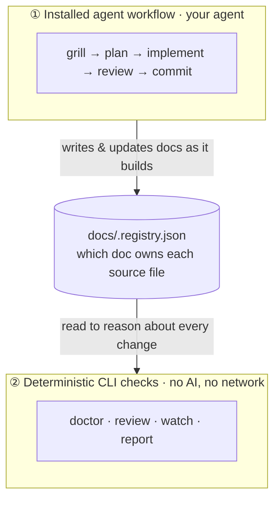
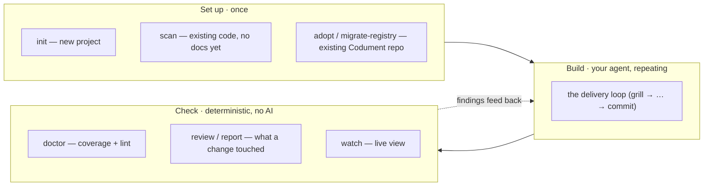
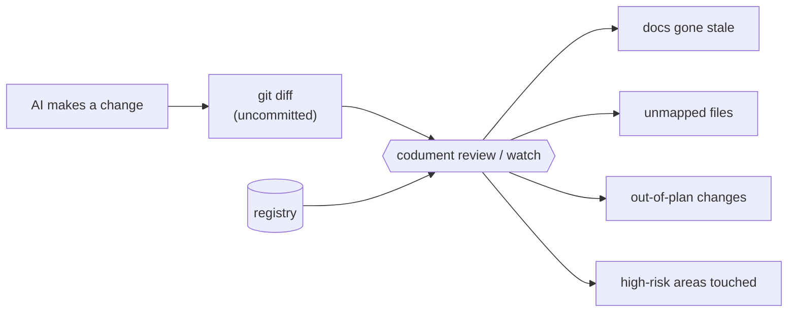
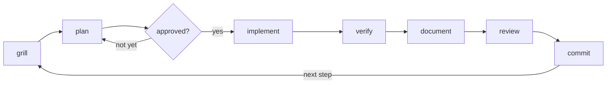

# codument

A deterministic, git-native change-control safety layer for AI-made changes — plus the docs-backed delivery workflow that produces them.

[](LICENSE)

Codument has **two sides**:

1. **Installed agent workflow (automatic).** A small project operating system for agent-led engineering — docs, source-to-doc ownership, planning guidance, workflow skills, review discipline, and commit hygiene. Your agent routes clear intent into the right phase from the installed instructions; you do not have to name a skill. The core loop is:

   ```text
   grill -> plan -> approve -> implement -> verify -> document -> review -> commit -> repeat
   ```

2. **Deterministic CLI safety checks.** Local, no-network, no-AI commands that read the repo and tell you the facts: `doctor` (documentation coverage + registry lint), `review` (what an AI change touched, what docs went stale, what is unmapped or out-of-plan), and `watch` (a live terminal view of the same). Same repo state → same output.

The docs are not a side quest. They are the durable control plane — a v2 registry mapping source files to the features that own them — that lets Claude, Codex, and future agents pick up the next step without relying on chat history, and that the safety checks read to reason about change.



## Try it in 30 seconds

One command runs a click-through showcase on a throwaway sample repo — your docs today → an AI makes a sweeping change → exactly what that change broke that you'd otherwise merge blind, opened as an HTML report. Press Enter to advance each scene (or add `--auto`).

```bash
npx codument demo
```

Or watch it happen live in a single terminal — the change-state panel starts clean, then the AI change lands and the counts light up in place:

```bash
npx codument demo --live
```

(From a checkout of this repo: `npm run demo` or `npm run demo:live`.)

## Which command, when



## Install

```bash
npm install -D codument
```

## New Projects

```bash
npx codument init
```

Use `init` for fresh projects that do not already have Codument docs. By default, Codument installs the Codex/generic profile:

- `AGENTS.md` with the shared delivery workflow
- `.agents/skills/` with the core workflow skills
- `docs/` with feature, concept, guide, and ADR structure
- `docs/.registry.json` mapping source files to docs
- `.codument-meta.json` recording installed agent profiles

Install specific agent profiles with:

```bash
npx codument init --agents codex
npx codument init --agents claude
npx codument init --agents codex,claude
```

The Claude profile also writes `.claude/skills`, `.claude/agents`, `.claude/rules`, `.claude/settings.json`, and `CLAUDE.md`.

## Existing Code, No Codument Yet

```bash
npx codument scan
```

`scan` groups source files into feature and concept docs, creates scaffolds, and populates `docs/.registry.json`. New entries are marked `needs-review`; run `/update-docs` to fill them with real content.

## Existing Codument Projects

Use `adopt` when a project already has Codument docs, an older `.codument-meta.json`, or a legacy registry (the flat `sources` shape, or the old `mappings` shape).

```bash
npx codument adopt --dry-run --agents codex,claude
npx codument adopt --agents codex,claude
```

`adopt` is the migration/onboarding path. It:

- migrates a legacy `docs/.registry.json` into the **v2** ownership shape (`primary_sources`, `related_sources`, `docs`, `depends_on`, `risk`)
- keeps the old registry as `docs/.registry.backup.json`
- refreshes `.codument-meta.json` with current project detection and selected agents
- installs or updates the selected agent profiles using the same managed-file logic as `update`

If you only want to convert the registry (no profile changes), run the one-shot migration directly — it is idempotent and backs up first:

```bash
npx codument migrate-registry --dry-run
npx codument migrate-registry
```

The v2 model is the only shape the analyzers read; the legacy shape is converted once and then never read again.

## Deterministic change-control checks

These commands are local, need no network and no AI model, and produce the same output for the same repo state. They read the v2 registry, the filesystem, and `git`.



### `codument doctor` — documentation coverage

"Test coverage for your docs." A deterministic gap-finder, not a quality judge.

```bash
npx codument doctor
npx codument doctor --json     # stable machine contract for CI/badges
npx codument doctor --write    # write .codument/coverage.json + an SVG badge
```

It reports two separate channels, never blended into one number:

- **Coverage (scored):** ownership (in-scope source files with a documented owner), dependency (mature entries declaring `depends_on`), risk (declared high-risk areas with a durable doc), and freshness/drift (over a git-history window). The headline score is the equal-weight average of the ratios that apply; a ratio with no denominator (e.g. risk before you add hints) is excluded, never counted as 0% or 100%.
- **Lint (warnings):** missing/leaked sources, missing docs, high-fanout files, empty `depends_on`, unmapped sources, and bloated docs (whole-doc size, oversized sections, never-compacted completed-step logs — tunable with `--max-doc-lines`, `--max-section-lines`, `--max-completed-log`).

`doctor` is warning-only: findings never change the exit code.

### `codument review` — review an AI change

Reads the uncommitted git diff against the registry and reports what changed and what is suspicious:

```bash
npx codument review
npx codument review --json
```

- changed files grouped by the feature that owns them
- **stale docs** — a source changed but its mapped doc did not
- **high-risk areas touched** (auth, data-loss, etc.)
- **out-of-plan changes** when an approved plan (`Status: approved` with a `## Scope`) is detected
- **unmapped changes** with no registry owner, high-fanout files, and dependent features that may need re-review

It reports repo facts and gaps — it does not certify that a change is safe.

### `codument report` — the same review as a shareable HTML page

For something you can read at a glance, screenshot, or hand to a teammate:

```bash
npx codument report          # writes .codument/report.html and opens it
npx codument report --no-open --out review.html
```

A self-contained HTML page (no network, no JS) that leads with a plain-language verdict and the coverage delta, with finding cards and a collapsible per-file breakdown — instead of a wall of terminal text.

### `codument watch` — live terminal view

A second terminal that continuously refreshes the same change-state while your agent works (no daemon, zero extra dependencies):

```bash
npx codument watch
npx codument watch --once          # one frame, for CI/inspection
npx codument watch --interval 1000
npx codument watch --dir ../other  # watch another repo without cd
```

`watch` reuses the exact analyzer `review` uses, so the live view and the snapshot can never disagree, and it tails the append-only `.codument/events.jsonl` flow log (which `review --log` and the workflow can write).

## Core Skills

Codument installs these delivery-loop skills:

| Skill | Purpose |
| --- | --- |
| `grill-with-docs` | Challenge a request against docs, code, ADRs, terminology, and edge cases before planning |
| `plan-with-docs` | Turn resolved decisions into a compact feature plan with steps and acceptance criteria |
| `tdd` | Implement one behavior slice at a time with the strongest practical feedback loop |
| `work-step` | Execute the next approved plan step without skipping ahead |
| `review-work` | Review the diff against the approved plan, tests, docs, registry, and architecture |
| `commit-work` | Verify, stage, and commit focused work with a conventional commit |
| `update-docs` | Fill scaffold docs or update mapped docs after source changes |

## Daily Workflow

Chat normally. Codument's always-loaded instructions route clear intent into the right delivery skill; slash commands are just explicit overrides when you want to force a phase.



1. Rough ideas and ambiguous feature requests trigger `grill-with-docs`.
2. Settled scope triggers `plan-with-docs`, which writes the durable plan and stops for approval.
3. Approved plans trigger `work-step` for the next unchecked step.
4. Completed implementation steps trigger `review-work` before any commit.
5. Clean or explicitly resolved reviews offer `commit-work` as the next gated action.
6. After commit, the agent offers the next work step, plan review, context compaction, or pause.

Working state should stay compact. Feature docs should capture the durable decisions, current plan, acceptance criteria, verification strategy, gotchas, and key files, not a transcript of every agent turn.

## Run the approved plan — "codument it"

Codument never runs your coding agent — your agent does. So you trigger autopilot by telling your agent, not by running a CLI command. There is no `codument run` command, and there never will be: the Codument CLI only does setup and deterministic checks (`init`, `scan`, `doctor`, `review`, `watch`, `migrate-registry`, `adopt`, `update`, `benchmark`).

Once a plan is approved, tell your agent:

> codument, run the plan

(also recognized: "run the plan", "codument this plan", "autopilot", or `/work-step --auto`).

Your agent then works the approved plan end to end: for each remaining step it implements, reviews, and commits without stopping for routine confirmations — one focused commit per step, under your own identity (no AI co-author trailer).

Autopilot is opt-in per run and off by default. The per-step gates still run; autopilot only stops *waiting* for your routine confirmation. It will not start until the plan is approved (look for `Status: approved` in the plan), and it pauses to ask you when something needs a real decision:

- a review finding that needs a human judgment call (and always for changes touching public interfaces, security, data loss, or dependencies),
- a failing verification, or
- a change that would fall outside the approved plan.

To stop early, tell your agent **"pause"** or **"stop autopilot"**. To run a single fully-gated step the old way, say **"work the next step"** or `/work-step` without `--auto`.

## Acknowledgements

Thanks to Matt Pocock's [mattpocock/skills](https://github.com/mattpocock/skills), especially `/grill-with-docs`, which helped shape Codument's habit of grilling ideas against the docs before coding.

## Update Managed Files

```bash
npx codument update
npx codument update --dry-run
```

`update` refreshes the managed files for the agent profiles recorded in `.codument-meta.json`. Override the stored profiles when needed:

```bash
npx codument update --agents codex,claude
```

## Proof Benchmarks

Codument ships self-contained proof benchmarks. They do not call an AI model, require telemetry, or judge work subjectively.

The context benchmark compares two deterministic context-selection strategies over a packaged fixture:

```bash
npx codument benchmark context
npx codument benchmark context --json
```

Current fixture output:

```text
Naive context:    3,068 estimated file-context tokens (16 files)
Codument context: 1,746 estimated file-context tokens (8 files)
Reduction:        43.1%

Relevance:
  Required docs found:       3/3
  Required source files:     4/4
  Irrelevant files included: 0/8
```

These are estimated file-context tokens using `ceil(characters / 4)`. The benchmark proves that the packaged registry can route a known task to a smaller relevant working set. It does not claim every real task will reduce total model tokens; small tasks may spend more on workflow than they save.

The quality benchmark gives any coding agent the same fixture task and scores the final repo deterministically:

```bash
npx codument benchmark init /tmp/codument-bench --agents codex
cd /tmp/codument-bench
# Give BENCHMARK_TASK.md to your agent.
npm test
npx codument benchmark score /tmp/codument-bench
```

`benchmark score` checks the final files for passing tests, required behavior, docs updates, registry coverage, protected fixture metadata, source boundaries, and benchmark-specific shortcuts. It scores the final repo state, not the agent's private reasoning or path to the answer.

Expected scoring shape:

```text
Fresh fixture:     6/9 FAIL
Completed fixture: 9/9 PASS
```

To compare a baseline against Codument, initialize two fixture directories and give both agents the same task. In the baseline run, ask the agent to solve directly without using Codument's installed workflow. In the Codument run, ask it to follow `AGENTS.md` and the skills. Score both directories with the same `benchmark score` command.

## Documentation Structure

```text
docs/
  .registry.json
  overview.md
  getting-started.md
  features/
  concepts/
  architecture/decisions/
  guides/
```

The registry is the source of truth for which docs own which source files. Agents must check it before and after source edits.

## Developing codument

When developing Codument itself, you can test a local checkout against another project by building the CLI and running it directly:

```bash
cd /path/to/codument
npm run build

cd /path/to/existing-project
node ../codument/dist/cli.js adopt --dry-run --agents codex,claude
```

To test hooks that call `node_modules/codument/...`, install a local packed copy of your checkout:

```bash
cd /path/to/codument
npm --cache /private/tmp/codument-npm-cache pack

cd /path/to/existing-project
npm install -D ../codument/codument-0.4.0.tgz
npx codument adopt --agents codex,claude
```

## Requirements

- Node.js >= 18
- An AI coding agent that can read repo instructions and markdown skills

## License

Codument is open-source software released under the [Apache License 2.0](./LICENSE). See also the [NOTICE](./NOTICE) file for attribution.
