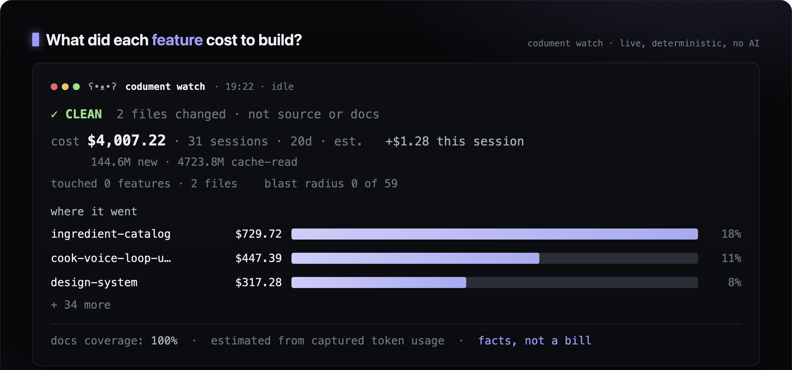
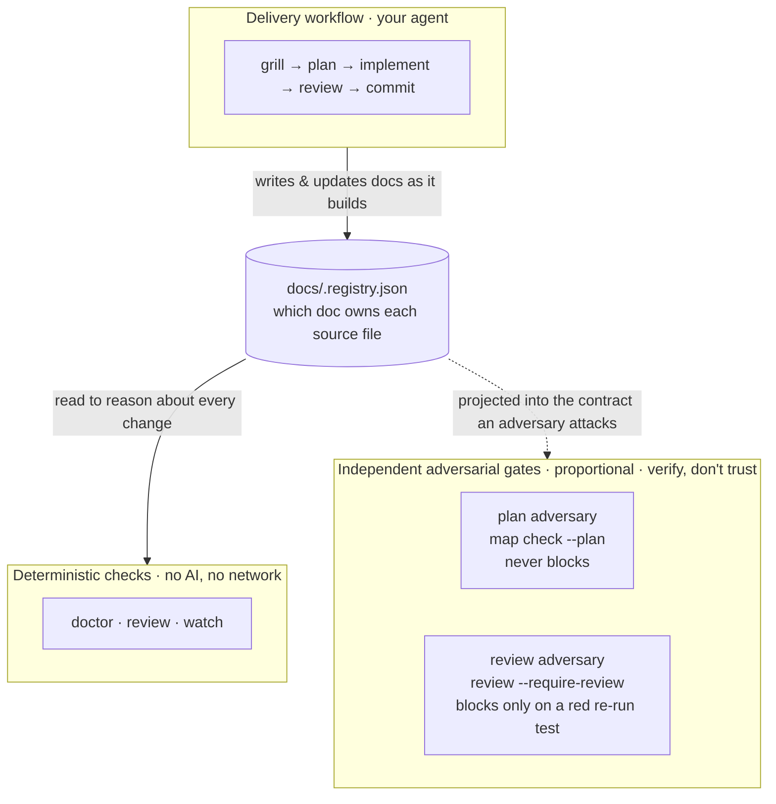
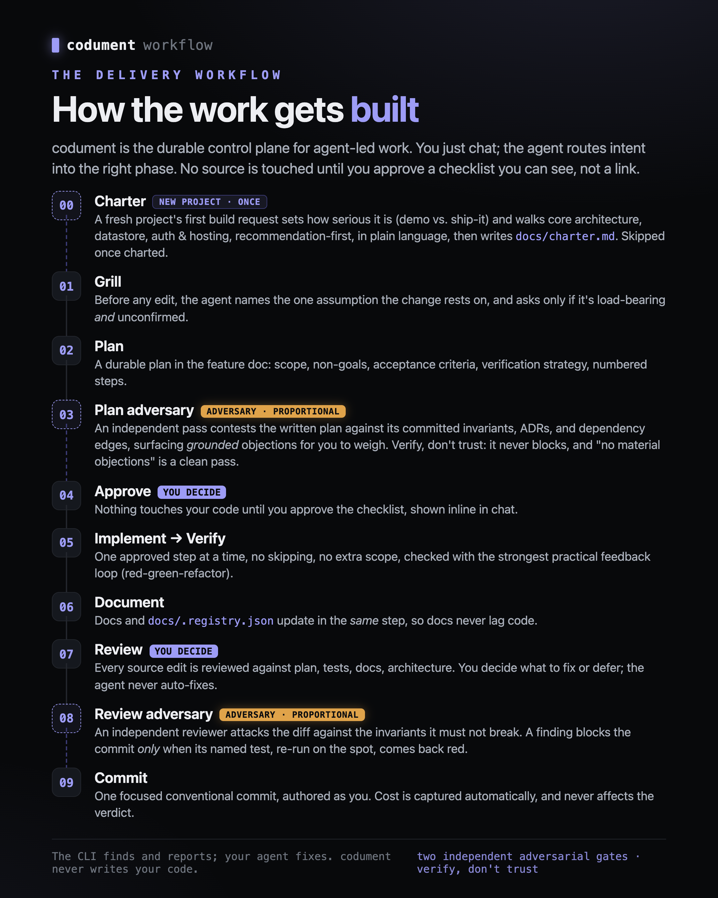
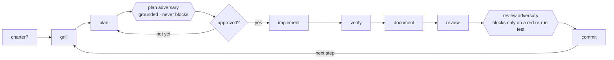

<div align="center">

# codument

**Change control for AI-made changes.**

A deterministic, git-native safety layer for what your coding agent touches.
Two independent adversarial gates, and the docs-backed workflow that produces them.

<!-- status -->
[](https://www.npmjs.com/package/codument)
[](LICENSE)
[](package.json)
[](tests)

<!-- what it is -->
[](#3--check--terminal-deterministic-core--independent-adversarial-gates)
[](#3--check--terminal-deterministic-core--independent-adversarial-gates)
[](#3--check--terminal-deterministic-core--independent-adversarial-gates)
[](#what-it-is)

<!-- works with -->
[](#1--set-up--terminal-once)
[](#1--set-up--terminal-once)
[](#1--set-up--terminal-once)

<!-- in the box -->
[](#3--check--terminal-deterministic-core--independent-adversarial-gates)
[](#2--build--your-agent-ongoing)
[](#the-two-adversarial-gates-independent-proportional)

<br>



<sub><code>codument watch</code> · estimated from captured token usage · facts, not a bill</sub>

<br>

**[Quick start](#try-it-on-your-own-repo--two-commands-zero-commitment)** · **[30-second demo](#try-it-in-30-seconds)** · **[How it works](#what-it-is)** · **[Docs](docs/)** · **[Report an issue](https://github.com/jakubsuplicki/codument/issues)**

</div>

## What it is

Codument has **two sides** that work together, and an **independent adversarial layer** for when you want more than facts:

- **A delivery workflow your agent runs.** Docs-backed planning, source-to-doc ownership, review discipline, and commit hygiene. You just chat; your agent routes intent into the right phase from the installed instructions. Core loop: `grill → plan → approve → implement → verify → document → review → commit`.
- **Deterministic CLI checks you run.** Local, no-network, no-AI commands that read the repo and report the facts: `doctor` (coverage + lint), `review` (what a change touched, what went stale, per-symbol drift), `watch` (a live view). Same repo state → same output. This core stays honestly deterministic — no model, no network, reproducible.
- **Two independent adversarial gates — verify, don't trust.** On top of the deterministic core sit two gates that *do* involve an AI reviewer but never ask you to trust its word. They are **proportional**, not skippable extras: they fire on the work that warrants them and are skipped on trivial edits. A **plan adversary** contests the written plan before code exists (`map check --plan`); it only ever raises grounded objections and it **never blocks** — the human adjudicates. A **review adversary** contests any non-trivial diff after the work (`review --require-review`), handed a fingerprint-bound bundle to attack; it blocks **only** when a finding's named test is genuinely red on a live re-run. The AI proposes; a deterministic oracle (a re-run test, a grounding projection, an auto-invalidating ack) decides. That is why adding AI here does not undercut "deterministic by default": every verdict the gates hand back is pinned to something reproducible.

The link between all of it is **`docs/.registry.json`** — a registry mapping each source file to the feature/doc that owns it. The workflow writes it as it builds; the checks read it to reason about every change; the gates project it into the contract an adversary attacks.



## How you run it

codument is two tools used in two places — keeping them straight is the whole trick:

| Where | What it's for | Examples |
| --- | --- | --- |
| 🖥️ **Your terminal** (you type) | setup, the deterministic checks, upgrades | `codument init`/`scan`/`adopt` · `codument doctor`/`review`/`watch` · `codument update` |
| 💬 **Your agent** (you just chat) | the delivery workflow and the fixes | `grill → … → commit` · `/update-docs` · `/review-work` |

**Rule of thumb: the CLI finds and reports; your agent fixes.** Codument never writes your code or docs.

The flow, start to finish:

```text
1. Set up    terminal · once      npm i -D codument  →  codument init | scan | adopt
2. Build     agent · ongoing      just chat: grill → plan → implement → review → commit
3. Check     terminal · anytime   codument doctor | review | watch
4. Fix       agent                /update-docs … your agent clears what the checks found
5. Upgrade   terminal · rare      codument update   (after bumping the package)
```

## Try it in 30 seconds

One command runs a click-through showcase on a throwaway sample repo — your docs today → an AI makes a sweeping change → exactly what that change broke that you'd otherwise merge blind, opened as an HTML report. Press Enter to advance each scene (or add `--auto`).

```bash
npx codument demo
```

Or watch it happen live in a single terminal — the change-state panel starts clean, then the AI change lands and the counts light up in place:

```bash
npx codument demo --live
```

(From a checkout of this repo: `npm run demo` or `npm run demo:live`.)

## Try it on your own repo — two commands, zero commitment

Before adopting anything, quantify the doc drift your committed history already carries:

```bash
npx codument scan                    # propose a registry + doc scaffolds (nothing committed)
npx codument audit v1.0.0..HEAD      # replay your history against that map
```

`scan` proposes which docs would own which sources; `audit` then reports every feature whose
source moved in the range while its doc got no attention — per symbol, with an honest "doc never
committed" where no doc existed yet. That is the drift the live gate would have caught. Read the
damage report, then decide. Nothing is gated and nothing needs committing — delete the scaffolds
and you've adopted nothing.

## 1 · Set up — terminal, once

```bash
npm install -D codument
```

Then run **one** of these, matching your project:

### New project → `init`

```bash
npx codument init
```

Installs the Claude profile by default:

- `AGENTS.md` and `CLAUDE.md` with the shared delivery workflow
- `.claude/skills/` with the core workflow skills
- `.claude/agents/`, `.claude/rules/`, and `.claude/settings.json` for Claude-specific subagents, rules, and the documentation hook
- `docs/` with feature, concept, guide, and ADR structure
- `docs/.registry.json` mapping source files to docs
- `.codument-meta.json` recording installed agent profiles

Pick profiles explicitly with `--agents claude`, `--agents codex`, or `--agents codex,claude`. The Codex/generic profile writes `AGENTS.md` and `.agents/skills/` only — portable across any agent that reads `AGENTS.md`.

### Existing code, no docs yet → `scan`

```bash
npx codument scan
```

Groups source files into feature and concept docs, creates scaffolds, and populates `docs/.registry.json`. New entries are marked `needs-review`; run `/update-docs` (the agent) to fill them with real content.

### Existing Codument project → `adopt`

```bash
npx codument adopt --dry-run --agents codex,claude
npx codument adopt --agents codex,claude
```

Use `adopt` when a project already has Codument docs or an older `.codument-meta.json`. It normalizes `docs/.registry.json` into the ownership shape (`primary_sources`, `related_sources`, `docs`, `depends_on`, `risk`), backs the previous file up as `docs/.registry.backup.json`, refreshes `.codument-meta.json`, and installs/updates the selected agent profiles. To re-derive the registry from source at any time, re-run `scan` — it overwrites the machine-derived entries while preserving your human-authored `docs`/`depends_on`/`risk`.

## 2 · Build — your agent, ongoing

Chat normally. Codument's always-loaded instructions route clear intent into the right delivery skill; slash commands are just explicit overrides when you want to force a phase.

<p align="center">
  
</p>



0. On an uncharted project, the first real-work-intent message triggers `establish-charter` once: it asks whether this is a quick demo or a serious app, then walks the core tech and architecture choices recommendation-first — explained in plain language with trade-offs, so even a non-technical user understands the decisions — and writes `docs/charter.md`. A pure question doesn't trip it; a charted project skips it.
1. Before any source edit the agent names the assumption the change depends on; a load-bearing one it cannot confirm — or a rough, ambiguous request — triggers `grill-with-docs`.
2. Settled scope triggers `plan-with-docs`, which writes the durable plan and stops for approval.
3. Approved plans trigger `work-step` for the next unchecked step.
4. Any source edit gets reviewed before commit — `review-work` inside a plan, the same bar for an ad-hoc fix.
5. Clean or explicitly resolved reviews offer `commit-work` as the next gated action.

The installed workflow skills:

| Skill | Purpose |
| --- | --- |
| `establish-charter` | On an uncharted project, set its seriousness (demo vs. serious) and walk the core tech/architecture choices recommendation-first, then write `docs/charter.md` — once, before the first grill |
| `grill-with-docs` | Resolve the load-bearing assumptions a change depends on, against docs, code, ADRs, and edge cases, before planning |
| `plan-with-docs` | Turn resolved decisions into a compact feature plan with steps and acceptance criteria |
| `tdd` | Implement one behavior slice at a time with the strongest practical feedback loop |
| `work-step` | Execute the next approved plan step without skipping ahead |
| `review-work` | Review the diff against the approved plan, tests, docs, registry, and architecture |
| `commit-work` | Verify, stage, and commit focused work with a conventional commit |
| `update-docs` | Fill scaffold docs, or update/compact mapped docs after source changes |

They travel with a set of domain-expertise skills — `senior-backend`, `senior-architect`, `senior-frontend`, `frontend-design`, `motion-craft`, `code-reviewer`, `review-codebase`. Those are advisory craft depth your agent consults when a step fits their domain; they never replace the workflow gates above.

Keep working state compact. A feature doc carries the standard's durable layers — plain-terms orientation, design approach, invariants with their test pointers, decisions, key files. A plan's delivery scaffolding (checklist, acceptance criteria, verification) lives in the doc only while the work is in flight and compacts out when it ships — never a transcript of every agent turn. (To run an approved plan end-to-end without per-step prompts, see **Autopilot** in Reference.)

## 3 · Check — terminal (deterministic core + independent adversarial gates)

The commands below are local, need no network and no AI model, and produce the same output for the same repo state — they read the registry, the filesystem, and `git`. The two **adversarial gates** at the end of this section are the opt-in exception: they involve an AI reviewer but decide every verdict with a deterministic oracle (a re-run test, a grounding projection), so the default path stays reproducible.

### `codument doctor` — documentation coverage

"Test coverage for your docs." A deterministic gap-finder, not a quality judge.

```bash
npx codument doctor
npx codument doctor --json     # stable machine contract for CI/badges
npx codument doctor --write    # write .codument/coverage.json + an SVG badge
npx codument doctor --strict   # exit 1 if there are findings, to gate a CI step
```

It reports separate channels, never blended into one number:

- **Coverage (scored):** ownership (in-scope source files with a documented owner), dependency (mature entries declaring `depends_on`), and risk (declared high-risk areas with a durable doc). The headline score is the equal-weight average of the ratios that apply; a ratio with no denominator is excluded, never counted as 0% or 100%. Freshness/drift is deliberately *not* scored here — staleness is the change-control gate's job (`codument review`), and a coverage ratio for it lands only once it can be re-sourced from that same signal instead of a second, disagreeing definition.
- **Lint (warnings):** missing/leaked sources, missing docs, empty or dangling `depends_on` edges, unmapped sources, dead intra-repo doc links, and bloated docs (whole-doc size, oversized sections, never-compacted completed-step logs — tunable with `--max-doc-lines`, `--max-section-lines`, `--max-completed-log`). These are *findings* — a clean registry has zero.
- **Notes (informational):** high-fanout files (a file mapped across many features), thin docs (a doc claimed done with no narrated orientation layer), and orphan doc pages (a feature/concept page no registry entry owns, which the staleness gate therefore cannot cover). Awareness-only — they never count toward "clean", because acting on them blindly degrades the registry (see the findings table below).

`doctor` is warning-only by default: neither findings nor notes change the exit code. Add `--strict` to make findings exit 1 (notes still never do), so a CI step can block a merge until they are cleared.

### `codument review` — review an AI change

Reads the uncommitted git diff against the registry and reports what changed and what is suspicious:

```bash
npx codument review
npx codument review --json
```

- changed files grouped by the feature that owns them
- **stale docs** — a source changed but its mapped doc did not
- **high-risk areas touched** (auth, data-loss, etc.)
- **out-of-plan changes** when an approved plan (`Status: approved` with a `## Scope`) is detected
- **unmapped changes**, high-fanout files, and dependent features that may need re-review

It reports repo facts and gaps — it does not certify that a change is safe.

The `review` command has grown beyond the default report. Every flag below is optional; with no flags it is the deterministic reporter above.

```bash
npx codument review --strict          # step-sync gate: exit 1 on new unmapped source or a stale mapped doc
npx codument review --base main       # review branch drift since the merge-base with <ref>, not just uncommitted changes
npx codument review --log             # append a caught snapshot to .codument/events.jsonl (impact ledger)
npx codument review --bundle          # emit the adversarial-review bundle as JSON, then exit
npx codument review --record findings.json   # record a fingerprint-bound review from a findings JSON, then enforce it
npx codument review --require-review  # exit 1 if a non-trivial diff has no current review artifact, or one with unresolved findings
npx codument review --require-review --test-command "npx tsx --test {file}"   # how a finding's named test is re-run ({file} = resolved path)
```

- **`--strict`** is the **step-sync gate**: it exits 1 while a step left a new source unmapped or a mapped doc stale. It is what Autopilot runs before checking a step off — materialize the file(s) and update the stale doc(s), then re-run until clean.
- **`--base <ref>`** reviews the whole branch's drift (merge-base..working-tree), not just uncommitted changes — pair it with `codument ack --base <ref>` so a symbol move resolves against the same ref.
- **`--bundle`** emits the adversarial-review bundle (the documented invariants + their tests + the diff) as JSON — the contract an independent reviewer attacks. The deterministic oracle that *decides* is the re-run of a finding's named test, never the bundle itself. **`--record <file>`** records a fingerprint-bound review from a findings JSON (`{invariantsChecked, findings, signer}`) that **`--require-review`** then enforces — exiting 1 on a non-trivial diff with no current artifact, or one carrying unresolved confirmed findings. A finding **blocks only** when its named test is red on a live re-run (`--test-command`, `{file}` = the resolved path; default `npx --no-install tsx --test {file}` — resolved locally, **never fetched from the network**); point it at a TAP-emitting runner for non-`node:test` projects. When no runner is resolvable without a fetch, the summary says so by name ("confirm step could not run — pass `--test-command`") instead of silently reading advisory. Opt-in today; the default-on flip is soak-deferred.

**Per-symbol drift.** Staleness is resolved **per symbol**, not per whole file. `review` fingerprints each exported declaration's token stream across two git refs; when a documented symbol **moved** and its owning doc did not, only that symbol's owning feature wakes — the old whole-file cascade is dissolved. The verdict is a pure, reproducible function of `(base, head, codument version, algoStamp)` with no clock input. It enforces that a moved documented symbol and its owning doc stay **in sync** (waking the feature when they don't), not that the prose is correct — a born-wrong or already-drifted doc is out of scope by construction. A separate name-match signal (does the doc even mention the symbol) is kept as **info-only telemetry**, never a verdict input. Before hashing, each declaration's token stream is **canonicalized**: a name bound within the declaration (a parameter, a block local, a destructured or catch binding, a generic type parameter) is rewritten to a positional index, so a meaning-preserving local rename does not move the fingerprint at all. What still fires is a real change — a different free/imported/global reference, a type or contract-name change (a property key, an object shorthand, a constructor parameter property), or a structural edit.

### `codument ack` — clear a change that owes no doc change

When a symbol moves but no documented contract changed, you don't paper over the gate with a mirror edit — you **acknowledge** it. An ack records a fingerprint-bound, **auto-invalidating** decision so `review` stops flagging it, and it takes two forms.

```bash
# per-symbol: a moved symbol was a contract-neutral refactor
npx codument ack src/registry.ts::readRegistry --reason "return shape unchanged"

# file-grain (bare path): a changed source file's current content owes no doc change
npx codument ack src/registry.ts --reason "added a helper export; no contract change"

npx codument ack --list                 # list recorded acks with their handles
npx codument ack --remove <handle>      # remove one by handle
npx codument ack src/foo.ts::bar --base main --signer alice   # match review --base; attribute the signer
```

- **Per-symbol ack (`<path>::<symbol>`)** is the agent-judge resolution that a **moved** symbol was a contract-neutral refactor owing no doc change. It is bound to the exact `from → to` fingerprint transition, so it **auto-invalidates the next time the anchor moves** — no ride-forever exemption. The gate verifies the ack's **form** only (it exists, is attributed with non-empty fields, and names the exact moved fingerprint), **never its semantic truth** — code/doc equivalence is undecidable, so honesty rests on the visible ack-rate and the durable audit trail, not a truth check.
- **File-grain ack (bare `<path>`, per ADR 012)** vouches that a changed source file's **current content** owes no doc change. It clears only **additive** (added/removed-symbol), **concept-umbrella**, and **coarse/non-TS** staleness, bound to the file's content fingerprint (auto-invalidating on the next change). It **never masks a moved symbol**: a `changed` (moved) owned symbol still wakes its feature, so a real contract change is never laundered. It **counts as an ack** — a distinct `file-acked` line on the no-doc-change-owed side, never as a doc update — so over-acking stays visible and the friction rate is not deflated. A parse-unevaluable file **cannot** be file-acked into freshness (the fail-loud stance holds).
- **Flags:** `--reason <text>` names the contract that stayed constant; `--base <ref>` resolves the move against the merge-base with `<ref>` (match the ref `review --base` used); `--signer <id>` sets attribution (defaults to the git author; an independent signer is what strict-mode independence checks); `--list` / `--remove <handle>` manage recorded acks; `--root <dir>` sets the project root.

*Honest limit:* the additive-owes-no-doc judgment (like the per-symbol ack's semantic claim) is **prose-enforced, not test-backed** — the gate checks the ack's form and fingerprint, never whether the human was right that no doc was owed.

### `codument audit` — score doc drift over committed history

The live gate pointed backwards: for each documented feature, symbol moves in a commit range whose
owning doc got no attention in the same range. Runnable on a repo that has adopted nothing (pair it
with `scan`, above) and on any release range of an adopted one.

```bash
npx codument audit v1.0.0..HEAD
npx codument audit v0.6.0..v0.7.0 --json   # version-tagged; byte-identical for the same repo state
```

- Same analyzer, same semantics as `review` — per-symbol staleness, deletions first-class (a
  rename's old path included), the registry-entry-removal dodge closed, parse-broken files
  surfaced instead of trusted. The range is diffed from the merge-base, so merged-in commits are
  not misattributed.
- Acknowledgments don't apply retroactively — an ack adjudicates the live working tree, not an
  arbitrary historical range — so the audit reports raw drift.
- **Informational by contract:** findings never change the exit code; `--json` carries
  `driftedCount` so you can threshold it yourself. Only an audit that *could not run* (bad range,
  unreachable ref, broken git) exits non-zero — "could not look" never reads as "no drift".

### `codument report` — the same review as a shareable HTML page

```bash
npx codument report          # writes .codument/report.html and opens it
npx codument report --no-open --out review.html
```

A self-contained page (no network, no JS) that leads with a plain-language verdict and the coverage delta, with finding cards and a collapsible per-file breakdown — instead of a wall of terminal text.

### `codument watch` — live terminal view

A second terminal that continuously refreshes the same change-state while your agent works (no daemon, zero extra dependencies):

```bash
npx codument watch
npx codument watch --once          # one frame, for CI/inspection
npx codument watch --interval 1000
npx codument watch --dir ../other  # watch another repo without cd
```

`watch` leads with a plain-words verdict — `✓ CLEAN`, `▲ DRIFTING`, `■ AT RISK`, or `⊘ OFF-PLAN` — over the all-sessions estimated cost and a per-feature breakdown. It reuses the exact analyzer `review` uses, so the live view and the snapshot can never disagree, and it tails the append-only `.codument/events.jsonl` flow log.

### `codument feed` — populate the event log from the agent's session

`feed` is the producer behind the live view: it tails the active Claude Code session transcript (the per-turn log Claude Code already writes), normalizes each turn's token usage + tool activity into `.codument/events.jsonl`, and attributes it to a feature via the registry. `watch` runs it for you each refresh (disable with `watch --no-feed`); call it directly for a one-shot backfill or a headless/CI populate.

```bash
npx codument feed              # tail the session log continuously
npx codument feed --once       # single backfill pass, then exit
npx codument feed --dir ../other
```

It reads telemetry that already exists (no extra token cost), is idempotent (a byte-offset cursor means restarts never double-count), and is best-effort against Claude Code's internal transcript format. It's the Claude-specific adapter for the otherwise vendor-neutral `emit` + events-log seam.

### `codument steps` — mirror the active plan's checklist

Prints the active plan's delivery-plan checklist so you can mirror it into a native to-do panel, and optionally logs the active step for `watch`:

```bash
npx codument steps                       # the single approved plan with an unchecked step
npx codument steps --json                # machine-readable, with per-step to-do status
npx codument steps --emit                # append a `step` event to .codument/events.jsonl (for watch)
npx codument steps --plan docs/features/foo.md
```

### `codument emit tokens` — estimated token cost, per feature

codument never calls an AI model, so it can't meter tokens itself. Instead your agent (or a small hook that reads its session transcript) reports usage as it works, and `watch` shows an **estimated** running cost, attributed to the feature being worked:

```bash
codument emit tokens --model opus-4.8 --input 1200 --output 340 \
  --cache-read 8000 --feature auth --step 3
```

That appends a **counts-only** record to `.codument/events.jsonl` — no dollars are stored. `watch` prices it live, under the verdict headline:

```text
  ✓ CLEAN    1 feature touched · docs current
  Cost       $0.50 estimated · 1 session
    auth         $0.32
    billing      $0.18
```

The four token buckets are priced separately — cache reads are ~10× cheaper than fresh input and dominate the count, so a single blended rate would overstate the bill badly. The figure is **always an estimate**, derived from a rate table at display time, never an invoice; per-feature numbers are an allocation of what the agent tagged.

**Setting prices.** codument bundles rates for **Claude models only** — deliberately, so it stays agent-neutral without shipping prices for vendors it can't keep current. To price anything else — Codex/GPT, Gemini, a fine-tune — or to override a default, add a `.codument/rates.json` to your project (USD per million tokens, per bucket; any bucket you omit is treated as `$0`):

```json
{
  "codex-1":  { "input": 1.5, "output": 6, "cacheRead": 0.2 },
  "gpt-5":    { "input": 2,   "output": 8 },
  "opus-4.8": { "output": 30 }
}
```

The numbers above are **illustrative** — fill in each provider's current published rates. Your file merges *over* the built-in defaults — add new models, or override a single bucket of an existing one. A model with no rate isn't an error: its tokens are still counted and it's flagged `unpriced` rather than priced wrong. And because only counts are stored, changing a rate re-prices everything — past logs included — on the next `watch`.

### `codument cost` — the full token-cost ledger

`watch` shows a glanceable top-3 of where spend went; `codument cost` prints the **whole** ledger from the captured `.codument/events.jsonl` — the all-sessions estimated total, then every feature, model, and (when attributed) step, sorted by spend with each line's share:

```bash
npx codument cost                 # the full ledger
npx codument cost --json          # the raw token summary, for scripts
npx codument cost --dir ../other  # another repo without cd
```

```text
codument cost  ·  my-app

  $3,992.79 estimated  ·  22006 events
  2.8M in · 33.9M out · 4.7B cache-read · 107.3M cache-create

by feature
  ingredient-catalog      $729.72   18%
  cook-voice-loop-ux…     $447.39   11%
  …

by model
  opus-4.8              $2,869.03   72%
  opus-4.7                $906.51   23%
```

It's a pure read — it never tails or mutates the log (refresh capture with `feed`/`watch` first) and needs no git repo, just a `.codument/events.jsonl`. Cost is derived from the rate table at read time (an **estimate**, never a bill); an unknown model is flagged `unpriced` rather than priced wrong.

### The two adversarial gates (independent, proportional)

Alongside the deterministic checks, Codument can run two **adversarial** gates. Both are proportional (they fire on the work that warrants them, not on trivial edits), both project the same committed docs and registry into a contract an independent reviewer attacks, and neither introduces a new source of truth or a model call on the verdict path. The principle is **verify, don't trust**: an AI raises the objection or finding; a deterministic oracle decides what it means.

**Plan adversary — `codument map check --plan <path>`.** Before any code is written, an independent adversary reads *only* the plan plus a deterministic grounding projection over `docs/.registry.json` and the committed feature docs (invariants, test pointers, dependency edges, risk tags, Feature-Map rows — emit it with `map check --plan <path> --json`). It surfaces only **grounded** objections — each must cite a committed constraint the plan contradicts or name a load-bearing assumption the grill left unresolved — one tight line each, most-serious-first, folded into the same open-questions block of the approval summary you already read. It **never blocks**, never rewrites the plan, never reopens the grill; the **human adjudicates** at the existing approve/change gate. "No material objections" is the correct, expected output for a well-grilled plan, not a failure. A plan with no Feature Map runs no adversary (proportionality skip).
*Honest limit:* its quality is **prompt-enforced, not test-backed**. A plan has no executable oracle, so groundedness — not correctness — is the only honest deterministic analog; no mechanism can prove an objection is grounded or catch a fabricated one, and manufacturing a weak objection is the cardinal failure the mandate guards against but cannot mechanically prevent. On a host without subagents no automatic independent pass runs at all — it degrades to a manual handoff (grounding + a paste-ready prompt + a plain statement that no independent pass ran), so the guarantee is genuinely weaker there. And because it never blocks, a wrong plan a human waves through is not stopped by the tool.

**Review adversary — `codument review --require-review`.** After the work, an independent adversary presumed to be hunting for failure is handed a precise **bundle** to attack (`review --bundle`): the diff, the documented invariants it must not break and the tests that pin them, the relevant plan slice, and ownership/blast facts. The verdict is **verify, don't trust** — a finding hard-**blocks only** when its named test is genuinely red when the gate **re-runs it on the spot** (a nonzero exit counts as red only with TAP evidence the runner actually executed tests); the fix flips it green. The gate re-derives every status and never trusts what an artifact claims. The artifact (`.codument/reviews/<id>.json`) is fingerprint-bound over the full change set *and* the named tests, so editing the diff or tampering a test after review auto-reopens the gate. It is opt-in; proportionality skips trivial edits; non-testable/judgment findings are recorded and routed to the review decision point, never auto-blocked.
*Honest limit:* an **empty or omitted-findings review still passes** — the gate enforces the review *ritual* (a diff-bound artifact enumerating the invariants checked) and verifies *declared* findings, but it does **not** certify thoroughness. Requiring TAP evidence to call a red test blocking means a runner that does not emit TAP (vitest/jest in default reporters) makes a real red test read as unrunnable → advisory (**fail-open**); a non-`node:test` project must point `--test-command` at a TAP-emitting runner or its findings stay advisory. The default runner resolves **local-only** (`npx --no-install`): the verdict path never downloads code, and a project where nothing resolves gets a named "confirm step could not run" condition in the summary rather than a silent always-green. Default-on is soak-deferred, so it is opt-in today, and only a finding reducible to a runnable failing test can ever block.

## 4 · Fix — from findings to clean

`doctor` and `review` report findings; they never auto-fix — codument stays a deterministic checker, so there is no `codument fix`. You clear findings the way you build features: your agent fixes them with the installed skills, then you re-run the check to confirm. A finding that re-runs clean is the "done" signal. The finding's *type* tells you which lever to pull:

| Finding | What it means | How to clear it |
| --- | --- | --- |
| **stale doc** (`review`) | a source changed but its mapped doc did not | `/update-docs` — update the doc from the current source; or, for a contract-neutral move, `codument ack <path>::<symbol>` instead of editing prose |
| **bloated-doc** | a doc is too long, has an oversized section, or carries a never-compacted `[x]` completed-log | `/update-docs` — **compact** it: drop the done log (it lives in git history), split big sections, keep the durable decisions. Not a rewrite. |
| **missing-doc** | a registered feature has no doc | `/update-docs` — write it from the template |
| **unmapped-source** | a real source file has no owning feature | add it to a feature's `primary_sources` in `docs/.registry.json` (or `codument scan` to propose mappings) |
| **generated-leakage** | a file matching an exclusion rule (build/generated/test/data, e.g. `dist/**`, `*.seed.json`) is listed as a source | de-list it — it is not tracked source. If the heuristic misfired on genuinely authored content, adjust the exclusion instead of forcing docs onto it |
| **empty-depends-on** | a mature, *isolated* entry declares no dependencies — nothing depends on it and it depends on nothing (a foundation that other entries depend on is exempt: it legitimately depends on nothing) | add its real `depends_on` edges, or set `depends_on_confirmed: true` on the entry after reviewing that a true leaf really has none (fresh `needs-review` scaffolds are exempt until reviewed) |
| **dangling-depends-on** | a `depends_on` slug names no registry entry — review's impact fan-out and the dependency score silently lose that edge | register the missing entry, or fix the slug if it is a typo |
| **link-rot** | a doc's intra-repo link or `[[wikilink]]` points at a file that does not exist | fix the link target, or remove the link if the page is gone for good |
| **thin-doc** *(note)* | a doc claimed done (`status: current`) has no narrated orientation layer — half-documented reads green to every other check | write the doc's "In plain terms" layer, or flip the entry to an honest in-flight status (`needs-review`/`draft`) |
| **orphan-doc** *(note)* | a feature/concept page no registry entry points at — the staleness gate structurally cannot cover it, so it rots silently | add it to the owning entry's `doc`/`docs` so the gate covers it, or knowingly leave it unowned (the note never blocks) |

**`high-fanout` is a note, not a finding — don't "clear" it.** A file mapped across many features is usually *correct*: shared infra (security rules, shared types, a root layout, a barrel file) is supposed to be mapped widely, and that breadth is exactly what lets `review` flag every dependent when it changes. Collapsing it to one owner to zero the count **severs that signal** — and the single owner is often the wrong one. Act only when the breadth is genuinely wrong (a test helper or unrelated utility mapped into features that don't own it); otherwise leave shared infra mapped widely, or raise `--high-fanout` if the threshold is noisy for your repo. "Clean" never requires touching it.

The skills already know this loop: `/update-docs` starts from `codument doctor` and `/review-work` starts from `codument review`, so your agent pulls the findings and clears them without you reciting them. Keep docs compact as you go and `bloated-doc` rarely fires.

## 5 · Upgrade — terminal, on version bumps

After bumping the codument package, re-sync the managed files (skills, rules, `AGENTS.md`/`CLAUDE.md`) for the agent profiles recorded in `.codument-meta.json`:

```bash
npx codument update --dry-run   # preview first
npx codument update
npx codument update --agents codex,claude   # override stored profiles
```

`update` only refreshes codument's own managed files — it never touches your docs or code. Entries you've customized are backed up to `<file>.backup`; symlinked/pointer skill entries are left untouched.

---

## Reference

<details>
<summary><b>Autopilot — "codument it"</b></summary>

Codument never runs your coding agent — your agent does. So you trigger autopilot by telling your agent, not by running a CLI command. Running `codument run` (alias `autopilot`) only prints this reminder and points you back at the phrase — the CLI itself does setup and deterministic checks, never your agent.

Once a plan is approved, tell your agent **"codument, run the plan"** (also recognized: "run the plan", "codument this plan", "autopilot", or `/work-step --auto`). Your agent then works the approved plan end to end: for each remaining step it implements, reviews, and commits without stopping for routine confirmations — one focused commit per step, under your own identity (no AI co-author trailer).

Autopilot is opt-in per run and off by default. The per-step gates still run; autopilot only stops *waiting* for your routine confirmation. It will not start until the plan is approved (`Status: approved`), and it pauses to ask when something needs a real decision:

- a review finding that needs a human judgment call (and always for changes touching public interfaces, security, data loss, or dependencies),
- a failing verification, or
- a change that would fall outside the approved plan.

To stop early, say **"pause"** or **"stop autopilot"**. To run a single fully-gated step, say **"work the next step"** or `/work-step` without `--auto`.
</details>

<details>
<summary><b>Proof benchmarks</b></summary>

Codument ships self-contained proof benchmarks. They do not call an AI model, require telemetry, or judge work subjectively.

The **context benchmark** compares two deterministic context-selection strategies over a packaged fixture:

```bash
npx codument benchmark context
npx codument benchmark context --json
```

```text
Naive context:    3,068 estimated file-context tokens (16 files)
Codument context: 1,746 estimated file-context tokens (8 files)
Reduction:        43.1%

Relevance:
  Required docs found:       3/3
  Required source files:     4/4
  Irrelevant files included: 0/8
```

These are estimated file-context tokens using `ceil(characters / 4)`. The benchmark proves the packaged registry can route a known task to a smaller relevant working set. It does not claim every real task reduces total model tokens; small tasks may spend more on workflow than they save.

The **quality benchmark** gives any coding agent the same fixture task and scores the final repo deterministically:

```bash
npx codument benchmark init /tmp/codument-bench --agents codex
cd /tmp/codument-bench
# Give BENCHMARK_TASK.md to your agent.
npm test
npx codument benchmark score /tmp/codument-bench
```

`benchmark score` checks the final files for passing tests, required behavior, docs updates, registry coverage, protected fixture metadata, source boundaries, and benchmark-specific shortcuts. Expected shape:

```text
Fresh fixture:     6/9 FAIL
Completed fixture: 9/9 PASS
```

To compare a baseline against Codument, initialize two fixture directories and give both agents the same task — one solving directly, one following `AGENTS.md` and the skills — then score both with the same command.

The **catch-rate benchmark** is the ground-truth proof behind the review step. It ships a feature diff that carries planted bugs as uncommitted work over a committed baseline, and scores how many your agent catches before commit — once with the review loop, once without:

```bash
# no-loop: ship the diff straight to commit
npx codument benchmark init /tmp/bench-noloop --seeded
# (commit the diff as-is, then:)
npx codument benchmark score /tmp/bench-noloop --mode no-loop

# loop: review the diff, fix what you find, then commit
npx codument benchmark init /tmp/bench-loop --seeded
# (run codument review + the review-work skill, fix, commit, then:)
npx codument benchmark score /tmp/bench-loop --mode loop --baseline /tmp/bench-noloop
```

Each bug has a hidden detector test that passes only when the bug is fixed; the answer key never ships into the scenario, so the agent can't read it. The `--baseline` comparison reports the loop-vs-no-loop delta. Because the no-loop baseline catches ~nothing by construction, the honest claim is "review catches X% that would otherwise ship," not a natural-catch-rate comparison.
</details>

<details>
<summary><b>The documentation model</b></summary>

Codument's docs follow two ideas that make them durable rather than decorative:

- **Registry-owned docs.** Every source file has an owning doc, recorded in `docs/.registry.json`. Ownership is what makes drift *detectable*: when a source file changes but its owner doesn't, that's a stale doc the deterministic checks can flag — not a judgment call.

- **One source, layered by audience.** A doc is never split into a "human version" and an "agent version" — two copies drift, which is the exact failure Codument exists to prevent. Instead each doc carries ordered layers in a single file, from plain to precise:

  ```text
  ## In plain terms            — what it does and why, no jargon
  ## Design approach           — why it is shaped this way, at guide level
  ## Invariants & boundaries   — what must always hold, each linked to the test that enforces it
  ## Decisions                 — the durable "why", pointing into ADRs
  ## Key files                 — where to start reading, by role
  ```

  A human reads the top and expands downward to learn; the agent reads all of it. Audience is a *presentation* concern, never a storage one — so there's only ever one thing to keep true. The machine-readable side — ownership, dependencies, risk — lives solely in `docs/.registry.json`, never duplicated into doc frontmatter where it would drift. And the line for what belongs in prose at all: keep only what survives a refactor that renames every symbol; mechanism is read live from the code.

Docs come in types — **features** (a capability), **concepts** (a cross-cutting idea), and **ADRs** (a recorded architecture decision) — and the layering applies within each.
</details>

<details>
<summary><b>Documentation structure</b></summary>

```text
docs/
  .registry.json
  overview.md
  getting-started.md
  features/
  concepts/
  architecture/decisions/
  guides/
```

The registry is the source of truth for which docs own which source files. Agents must check it before and after source edits.
</details>

<details>
<summary><b>Developing codument</b></summary>

Test a local checkout against another project by building the CLI and running it directly:

```bash
cd /path/to/codument
npm run build

cd /path/to/existing-project
node ../codument/dist/cli.js adopt --dry-run --agents codex,claude
```

To test hooks that call `node_modules/codument/...`, install a local packed copy:

```bash
cd /path/to/codument
npm --cache /private/tmp/codument-npm-cache pack

cd /path/to/existing-project
npm install -D ../codument/codument-0.7.0.tgz
npx codument adopt --agents codex,claude
```
</details>

## Contributing

codument is a solo-authored, source-available project. I build and maintain it on my own, so it's both a working tool and a portfolio of how I approach change control for AI-made changes.

I'm not accepting code contributions, so please don't open a pull request. It's nothing personal; I just want to keep the codebase something I can fully stand behind.

What is very welcome:

- 🐛 Bug reports and 💡 ideas → open an issue
- 🧪 "I ran it on my repo and here's what happened" → issues or Discussions
- ⭐ a star, if it's useful to you

The Apache-2.0 license lets you fork, run, and adapt it freely for your own use.

## Acknowledgements

Thanks to Matt Pocock's [mattpocock/skills](https://github.com/mattpocock/skills), especially `/grill-with-docs`, which helped shape Codument's habit of grilling ideas against the docs before coding.

## Requirements

- Node.js >= 18
- An AI coding agent that can read repo instructions and markdown skills

## License

Codument is open-source software released under the [Apache License 2.0](./LICENSE). See also the [NOTICE](./NOTICE) file for attribution.
