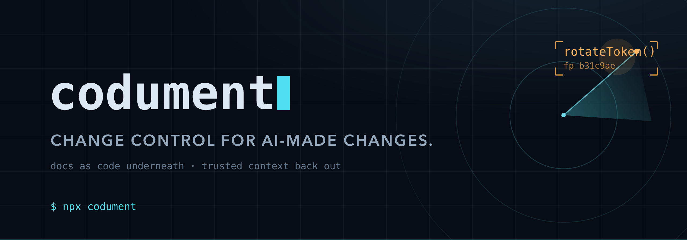
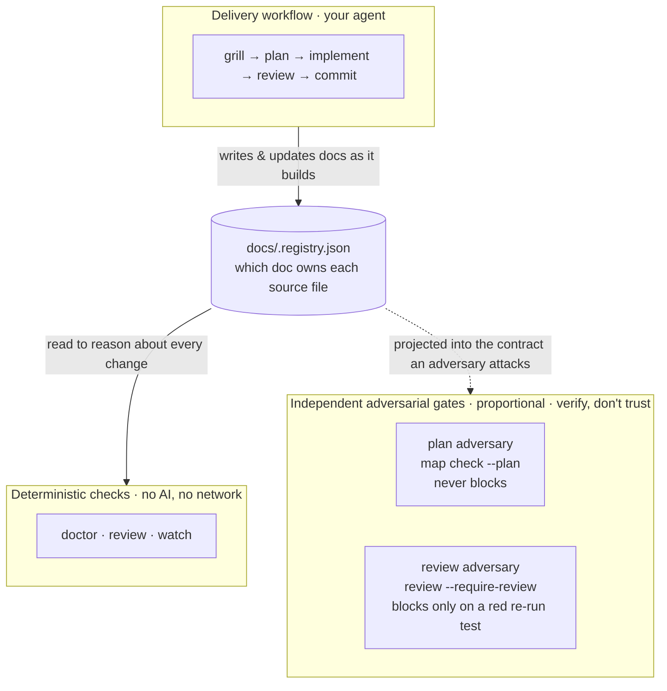
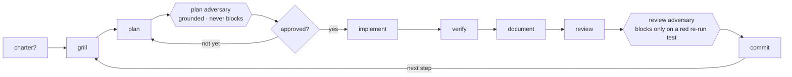

<div align="center">



<br><br>

A deterministic, git-native safety layer for what your coding agent touches.
Two independent adversarial gates, and the docs-backed workflow that produces them.

[](https://www.npmjs.com/package/codument)
[](LICENSE)
[](package.json)
[](tests)

[](#install)
[](#install)
[](#install)

**[Website](https://codument.studio/)** · **[Install](#install)** · **[30-second demo](#try-it-in-30-seconds)** · **[How it works](#how-it-works)** · **[Commands](#commands)** · **[Docs](docs/)** · **[Report an issue](https://github.com/jakubsuplicki/codument/issues)**

</div>

## Install

```bash
npm install -D codument
npx codument init
```

Then **start a new agent session** and chat normally. Describe what you want built; your agent grills the idea against your docs, writes a plan, and stops for your approval. **Approve it once and it builds the thing** — implementing, reviewing, documenting and committing each step on its own, and telling you where it is at every step.

- **Already have code?** Same command — `init` also maps your existing source to the docs that will own it. In that new session, say **`/update-docs`** once so those docs describe the code you already have.
- **Want it to slow down?** Say **"step by step"** and it stops at every gate for your say-so, and stays there until you say "keep going".
- **Why a new session?** Agents read their instructions when a session opens, so one you already had running won't see any of this.

<details>
<summary><b>Setup in full</b> — <code>init</code> vs <code>adopt</code>, agent profiles, and what each entry point writes</summary>

```bash
npx codument init      # new or existing project: the workflow, the docs structure,
                       # and — when there's already code — the map from source to docs
npx codument adopt     # existing Codument project: normalize + refresh
```

On a repo that already has code and no registry yet, `init` runs the discovery pass itself, so the map and the workflow arrive together. Pass `--no-scan` to install the workflow alone. `scan` remains a command you can run directly — it is the entry point of the zero-commitment trial under [Try it in 30 seconds](#try-it-in-30-seconds), and the way to re-derive the map later — but you no longer have to remember it during setup.

`init` installs the Claude profile by default (`AGENTS.md`/`CLAUDE.md`, `.claude/` skills + agents + rules, `docs/` with the registry). Pick profiles explicitly with `--agents claude`, `--agents codex`, or `--agents codex,claude`.

**Start a fresh agent session after setup.** Your agent reads its Codument workflow from files this step writes: `CLAUDE.md`/`AGENTS.md`, plus the `.claude/` skills and subagents. Coding agents load these when a session starts, so one you already had open won't see them. Start a new session (or run `/clear`) and your agent picks up the delivery loop, the skills, and the `/update-docs` step below. The git pre-commit gate from `codument hooks install` is the exception: git honors it on the next commit, no restart needed.

**Then have your agent write the docs.** On an existing codebase, setup only lays down empty scaffolds (marked `needs-review`). Tell your agent **`/update-docs`** and it reads your source to fill the registry's feature and concept docs with real content, giving `doctor` and `review` something to check against. That is the agent skill, not the `codument update` CLI (which only re-syncs codument's own managed files on a version bump).

### New project → `init`

```bash
npx codument init
```

Installs the Claude profile by default:

- `AGENTS.md` and `CLAUDE.md` with the shared delivery workflow
- `.claude/skills/` with the core workflow skills
- `.claude/agents/`, `.claude/rules/`, and `.claude/settings.json` for Claude-specific subagents, rules, and the documentation hook
- `docs/` with feature, concept, guide, and ADR structure
- `docs/.registry.json` mapping source files to docs
- `.codument-meta.json` recording installed agent profiles

Pick profiles explicitly with `--agents claude`, `--agents codex`, or `--agents codex,claude`. The Codex/generic profile writes `AGENTS.md` and `.agents/skills/` only — portable across any agent that reads `AGENTS.md`.

### Existing code, no docs yet → `init` (which scans for you)

```bash
npx codument init
```

The discovery pass groups source files into feature and concept docs, creates scaffolds, and populates `docs/.registry.json`. New entries are marked `needs-review`; run `/update-docs` (the agent) to fill them with real content.

It fires only when the repo has source *and* the registry is one this run created — an authored registry is `adopt`'s case and is never proposed over — and `--no-scan` declines it. You can still run `npx codument scan` on its own: it installs no workflow, which is exactly what makes it safe on a repo you haven't adopted (see [Try it in 30 seconds](#try-it-in-30-seconds)).

### Existing Codument project → `adopt`

```bash
npx codument adopt --dry-run --agents codex,claude
npx codument adopt --agents codex,claude
```

Use `adopt` when a project already has Codument docs or an older `.codument-meta.json`. It normalizes `docs/.registry.json` into the ownership shape (`primary_sources`, `related_sources`, `docs`, `depends_on`, `risk`), backs the previous file up as `docs/.registry.backup.json`, refreshes `.codument-meta.json`, and installs/updates the selected agent profiles. To re-derive the registry from source at any time, re-run `scan` — it overwrites the machine-derived entries while preserving your human-authored `docs`/`depends_on`/`risk`.

</details>

## Try it in 30 seconds

```bash
npx codument demo
```

One command runs a click-through showcase on a throwaway sample repo: your docs today, an AI makes a sweeping change, then exactly what that change broke that you'd otherwise merge blind, opened as an HTML report. Press Enter to advance each scene (or add `--auto`).

<details>
<summary>Watch it live instead, or measure the drift your own repo already carries — <code>demo --live</code> · <code>scan</code> · <code>audit</code></summary>

Or watch it live in a single terminal, the change-state panel starting clean, then lighting up in place as the AI change lands:

```bash
npx codument demo --live
```

(From a checkout of this repo: `npm run demo` or `npm run demo:live`.)

### Your own repo, two commands, zero commitment

Before adopting anything, quantify the doc drift your committed history already carries:

```bash
npx codument scan                    # propose a registry + doc scaffolds (nothing committed)
npx codument audit v1.0.0..HEAD      # replay your history against that map
```

`scan` proposes which docs would own which sources; `audit` then reports every feature whose source moved in the range while its doc got no attention, per symbol, with an honest "doc never committed" where none existed yet. That is the drift the live gate would have caught. Nothing is gated and nothing needs committing: delete the scaffolds and you've adopted nothing.

</details>

## Use it

codument is two tools used in two places, and keeping them straight is the whole trick:

| Where | What it's for | Examples |
| --- | --- | --- |
| 🖥️ **Your terminal** (you type) | setup, the deterministic checks, upgrades | `codument init`/`scan`/`adopt` · `codument doctor`/`review`/`watch` · `codument update` |
| 💬 **Your agent** (you just chat) | the delivery workflow and the fixes | `grill → … → commit` · `/update-docs` · `/review-work` |

**Rule of thumb: the CLI finds and reports; your agent fixes.** Codument never writes your code or docs.

```bash
npx codument doctor    # documentation coverage — a gap-finder, not a quality judge
npx codument review    # what this change touched, and what it left stale
npx codument watch     # a live panel while your agent works
```

<div align="center">


<sub><code>codument watch</code> · estimated from captured token usage · facts, not a bill</sub>

</div>

## How it works

<details>
<summary><b>The three pieces</b> — the workflow your agent runs, the checks you run, and the registry that ties them together</summary>

Codument has two sides that work together, plus an independent adversarial layer for when you want more than facts:

- **A delivery workflow your agent runs.** Docs-backed planning, source-to-doc ownership, review discipline, and commit hygiene. You just chat; your agent routes intent into the right phase. Core loop: `grill → plan → approve → implement → verify → document → review → commit`.
- **Deterministic CLI checks you run.** Local, no-network, no-AI commands that read the repo and report the facts: `doctor` (coverage + lint), `review` (what a change touched, what went stale, per-symbol drift), `watch` (a live view). Same repo state, same output. No model, no network, reproducible.
- **Two independent adversarial gates that verify, don't trust.** A plan adversary contests the written plan before code exists and never blocks; a review adversary contests a non-trivial diff and blocks only when a finding's named test is genuinely red on a live re-run. The AI proposes; a deterministic oracle decides, so adding AI here never undercuts "deterministic by default".

The connective tissue is **`docs/.registry.json`**, a registry mapping each source file to the feature/doc that owns it: the workflow writes it as it builds, the checks read it to reason about every change, and the gates project it into the contract an adversary attacks.



</details>

<a id="languages"></a>

<details>
<summary><b>Works with your stack</b> — TypeScript, JavaScript, Python, Go, Rust, C#, Java, Kotlin, Vue/Svelte/Astro — most of them symbol by symbol</summary>

| Language | Files | Resolution | Since |
| --- | --- | --- | --- |
| TypeScript | `.ts` `.tsx` `.mts` `.cts` | per-symbol | 0.7.0 |
| Python | `.py` `.pyi` | per-symbol | 0.9.0 |
| Go | `.go` | per-symbol | 0.9.0 |
| Rust | `.rs` | per-symbol | 0.9.0 |
| C# | `.cs` | per-symbol | 0.9.0 |
| Java / Kotlin | `.java` `.kt` `.kts` | per-symbol | 0.9.0 |
| Vue / Svelte / Astro | `.vue` `.svelte` `.astro` | blocks | 0.9.0 |

Per-symbol resolution for TypeScript, Python, Go, Rust, C#, Java, and Kotlin; per-part for Vue/Svelte/Astro; whole-file for JavaScript. Every other registered file is surfaced on change, never judged. The table is parity-tested against the adapter registry (`tests/language-matrix.test.ts`), so a shipped-but-unlisted or listed-but-unshipped language is a red test, not a stale claim.

<details>
<summary>Per-language anchor semantics (honest bounds)</summary>

TypeScript (`.ts`/`.tsx`, module flavors `.mts`/`.cts` included) resolves **per symbol** — including config files shaped like `export default defineNuxtConfig({...})`, which carry a precise `default.` anchor (comment and formatting edits fire nothing; a payload edit is reported and never blocks; swapping the producing callee is a contract change). **Python** (`.py`/`.pyi`) resolves **per symbol** through a bundled tree-sitter grammar (no interpreter, no ambient toolchain): a static `__all__` is honored as the public surface (its edit is a contract move), otherwise the underscore convention decides; a def's decorators, parameters, defaults, and return annotation are contract while the suite (docstrings included) is body; classes split per member; a module assignment's value is body while its target and annotation are contract — so a `settings.py` value flip is one named finding that gates nothing, and pytest conventions (`test_*.py`, `*_test.py`, `conftest.py`) plus environment trees (`venv`, `__pycache__`) stay out of scope. **Go** (`.go`) resolves **per symbol** through a bundled tree-sitter grammar: exported means capitalized (Go's own law), methods anchor under their receiver type with pointer and value receivers sharing one identity, grouped `const`/`var` blocks anchor per spec (names co-declared in one spec share a span, and an iota-style block anchors whole — inserting a member shifts later values, so it reads as a contract move, never silence), a struct's exported fields and tags are contract while unexported fields are body, and `_test.go` files stay out of scope. **Rust** (`.rs`) resolves **per symbol**: any `pub` form anchors (including `pub(crate)` — load-bearing inside the repo), impl members anchor under their type and trait-impl members under a trait-qualified identity, derives and attributes are contract, pub struct fields are contract while private fields are body, and a macro definition is one all-signature anchor with invocations honestly bounded to the residual (no expansion without rustc). **C#** (`.cs`) resolves **per symbol** (its members are its symbols): types anchor as contract frames while methods, properties, and fields anchor individually under nested type chains, partial-class fragments in one file fold into one identity, a property's accessor list (`get; set;` vs `get; init;`) is contract while accessor bodies and initializers are body, record positional parameters are contract, and top-level statements anchor on the file's residual — which, since 0.18.0, is reported rather than gated, because nothing that did not anchor as an export can be proven to have moved a contract. **Java and Kotlin** (`.java`/`.kt`/`.kts`) resolve **per symbol** through one anchor model over two bundled grammars, so a mixed JVM repo gates coherently: types are contract frames and methods, fields, and properties anchor individually under nested chains; annotations are contract (framework wiring like `@Service`/`@GetMapping` IS the interface); a data class's primary-constructor parameters are contract (the equality surface); enums anchor whole and overloads fold per name. Visibility follows each language's own rule — Java anchors `public`/`protected` while a bare package-private default joins the closure pool, whereas Kotlin's default is public so every non-`private` declaration anchors and `internal` counts as public within the repo. Canonical `src/test` source sets and `*Test`/`*Spec` files stay out of scope; a pathologically compact single-line Kotlin body classifies unevaluable (fail-loud) rather than mis-anchoring, while realistic multi-line code gates per symbol. **Vue, Svelte, and Astro components** (`.vue`/`.svelte`/`.astro`) resolve **per part**: script blocks get full per-symbol treatment through the TypeScript engine (a `<script setup>` block's top-level declarations are the component's public surface), while template and style are named, body-grain anchors — a markup tweak is one finding that gates nothing, a markup comment or reformat is silence, and a script contract change refuses the ack path. JavaScript (`.js`/`.jsx`/`.mjs`/`.cjs`) is gated at **whole-file grain**: any content change wakes the owning doc, cleared by a doc update or a file-grain ack. Declaration artifacts (`.d.ts`/`.d.mts`/`.d.cts`) are excluded outright — generated API surface, not judged; if you register one anyway, the exclusion still wins and `review` names the contradiction rather than dropping the file. Everything else — `.css`, `.json`, another language entirely — no adapter can *judge*, but the registry can still *govern*: name such a file in a feature's `primary_sources` and it is watched, attributed and reported at **whole-file grain**. Whether it *blocks* is one question further, and the answer is the project's, not the tool's: nothing in the file can be read, so the only artifact a block could demand is a signature over content nobody looked at. A `risk` tag on an owning entry is the project saying the opposite out loud — this file can do real damage unread — and that declaration turns the block on, cleared by a doc update or a file-grain ack signed over the changed lines the command shows you. Its **deletion** gates either way: the file is gone, which needs no reading to prove. Name it in `related_sources` instead and it stays impact-only — surfaced with its owning doc so you can check it by hand, never a verdict. Either way no *per-symbol* verdict is computed: the grain is coarse until an adapter for that format ships. New languages arrive as adapters on the gate's language-adapter seam, each required to pass the same eight-behavior conformance battery before it ships. The agent workflow around the gate — plans, registry, the docs standard, the adversarial gates — is language-agnostic.

</details>

</details>

<details>
<summary><b>The delivery workflow</b> — autopilot, how intent is routed, and the installed skills</summary>

Chat normally. Codument's always-loaded instructions route clear intent into the right delivery skill; slash commands are just explicit overrides when you want to force a phase.

<p align="center">
  
</p>

### Autopilot

**This is on by default, and approving the plan is what starts it.** Your agent then works the plan end to end — implementing, reviewing, documenting and committing each remaining step: one focused commit per step, under your own identity, no AI co-author trailer. It posts a checklist at every step boundary, so a run you aren't babysitting is still a run you can follow.

Every gate still runs. What's gone is the *waiting* — the turns where the only sensible answer was "yes, carry on". It still stops by itself the moment something needs you.

**To stop at the gates instead, say "step by step"** (or "stop at the gates", "one step at a time", "pause"). That holds for the rest of the session, until you say "keep going".

<details>
<summary>Autopilot precondition, pause conditions, and why there's no CLI command for it</summary>

Codument never runs your coding agent — your agent does. So autopilot lives in your agent's instructions, not in a CLI command. Running `codument run` (alias `autopilot`) only prints that reminder; the CLI itself does setup and deterministic checks, never your agent.

It will not start until the plan is approved (`Status: approved`) — that gate does not move, and it is the one place your say-so is always required. After that it pauses to ask when something needs a real decision:

- a review finding that needs a human judgment call (and always for changes touching public interfaces, security, data loss, or dependencies),
- a failing verification, or
- a change that would fall outside the approved plan.

To run a single step and stop, say **"work the next step"** or `/work-step` — an explicit one-step request is honored whatever the mode. The older trigger phrases ("codument, run the plan", "run the plan", "autopilot", `/work-step --auto`) still work; they just no longer have anything to turn on.

</details>

<details>
<summary>How the workflow routes intent, and the installed skills</summary>



0. On an uncharted project, the first real-work-intent message triggers `establish-charter` once: it asks whether this is a quick demo or a serious app, then walks the core tech and architecture choices recommendation-first — explained in plain language with trade-offs, so even a non-technical user understands the decisions — and writes `docs/charter.md`. A pure question doesn't trip it; a charted project skips it.
1. Before any source edit the agent names the assumption the change depends on; a load-bearing one it cannot confirm — or a rough, ambiguous request — triggers `grill-with-docs`.
2. Settled scope triggers `plan-with-docs`, which writes the durable plan and stops for approval.
3. Approved plans trigger `work-step` for the next unchecked step, and keep going through the remaining steps unless you've asked for the gates.
4. Any source edit gets reviewed before commit — `review-work` inside a plan, the same bar for an ad-hoc fix.
5. A clean review goes straight to `commit-work`; a finding that needs your judgment stops and asks.

The installed workflow skills:

| Skill | Purpose |
| --- | --- |
| `establish-charter` | On an uncharted project, set its seriousness (demo vs. serious) and walk the core tech/architecture choices recommendation-first, then write `docs/charter.md` — once, before the first grill |
| `grill-with-docs` | Resolve the load-bearing assumptions a change depends on, against docs, code, ADRs, and edge cases, before planning |
| `plan-with-docs` | Turn resolved decisions into a compact feature plan with steps and acceptance criteria |
| `tdd` | Implement one behavior slice at a time with the strongest practical feedback loop |
| `work-step` | Execute the next approved plan step without skipping ahead |
| `review-work` | Review the diff against the approved plan, tests, docs, registry, and architecture |
| `commit-work` | Verify, stage, and commit focused work with a conventional commit |
| `update-docs` | Fill scaffold docs, or update/compact mapped docs after source changes |

They travel with a set of domain-expertise skills — `senior-backend`, `senior-architect`, `senior-frontend`, `frontend-design`, `motion-craft`, `code-reviewer`, `review-codebase`. Those are advisory craft depth your agent consults when a step fits their domain; they never replace the workflow gates above.

Keep working state compact. A feature doc carries the standard's durable layers — plain-terms orientation, design approach, invariants with their test pointers, decisions, key files. A plan's delivery scaffolding (checklist, acceptance criteria, verification) lives in the doc only while the work is in flight and compacts out when it ships, never a transcript of every agent turn.

</details>

</details>

<details>
<summary><b>The two adversarial gates</b> — independent, proportional, verify don't trust</summary>

Alongside the deterministic checks, Codument can run two **adversarial** gates. Both are proportional (they fire on the work that warrants them, not on trivial edits), both project the same committed docs and registry into a contract an independent reviewer attacks, and neither introduces a new source of truth or a model call on the verdict path. The principle is **verify, don't trust**: an AI raises the objection or finding, and a deterministic oracle decides what it means. A **plan adversary** (`map check --plan`) contests the plan before code exists and never blocks; the human adjudicates. A **review adversary** (`review --require-review`) contests a non-trivial diff and hard-blocks only when a finding's named test is genuinely red on a live re-run.

<details>
<summary>How each gate works, and its honest limits</summary>

**Plan adversary — `codument map check --plan <path>`.** Before any code is written, an independent adversary reads *only* the plan plus a deterministic grounding projection over `docs/.registry.json` and the committed feature docs (invariants, test pointers, dependency edges, risk tags, Feature-Map rows — emit it with `map check --plan <path> --json`). It surfaces only **grounded** objections — each must cite a committed constraint the plan contradicts or name a load-bearing assumption the grill left unresolved — one tight line each, most-serious-first, folded into the same open-questions block of the approval summary you already read. It **never blocks**, never rewrites the plan, never reopens the grill; the **human adjudicates** at the existing approve/change gate. "No material objections" is the correct, expected output for a well-grilled plan, not a failure. A plan with no Feature Map runs no adversary (proportionality skip).
*Honest limit:* its quality is **prompt-enforced, not test-backed**. A plan has no executable oracle, so groundedness — not correctness — is the only honest deterministic analog; no mechanism can prove an objection is grounded or catch a fabricated one, and manufacturing a weak objection is the cardinal failure the mandate guards against but cannot mechanically prevent. On a host without subagents no automatic independent pass runs at all — it degrades to a manual handoff (grounding + a paste-ready prompt + a plain statement that no independent pass ran), so the guarantee is genuinely weaker there. And because it never blocks, a wrong plan a human waves through is not stopped by the tool.

**Review adversary — `codument review --require-review`.** After the work, an independent adversary presumed to be hunting for failure is handed a precise **bundle** to attack (`review --bundle`): the diff, the documented invariants it must not break and the tests that pin them, the relevant plan slice, and ownership/blast facts. The verdict is **verify, don't trust** — a finding hard-**blocks only** when its named test is genuinely red when the gate **re-runs it on the spot** (a nonzero exit counts as red only with TAP evidence the runner actually executed tests); the fix flips it green. The gate re-derives every status and never trusts what an artifact claims. The artifact (`.codument/reviews/<id>.json`) is fingerprint-bound over the full change set *and* the named tests, so editing the diff or tampering a test after review auto-reopens the gate. It is opt-in; proportionality skips trivial edits; non-testable/judgment findings are recorded and routed to the review decision point, never auto-blocked.
*Honest limit:* an **empty or omitted-findings review still passes** — the gate enforces the review *ritual* (a diff-bound artifact enumerating the invariants checked) and verifies *declared* findings, but it does **not** certify thoroughness. Requiring TAP evidence to call a red test blocking means a runner that does not emit TAP (vitest/jest in default reporters) makes a real red test read as unrunnable → advisory (**fail-open**); a non-`node:test` project must point `--test-command` at a TAP-emitting runner or its findings stay advisory. The default runner resolves **local-only** (`npx --no-install`): the verdict path never downloads code, and a project where nothing resolves gets a named "confirm step could not run" condition in the summary rather than a silent always-green. Default-on is soak-deferred, so it is opt-in today, and only a finding reducible to a runnable failing test can ever block.

</details>

</details>

## Commands

The commands below are local, need no network and no AI model, and produce the same output for the same repo state: they read the registry, the filesystem, and `git`. The two **adversarial gates** under [How it works](#how-it-works) are the opt-in exception: they involve an AI reviewer but decide every verdict with a deterministic oracle (a re-run test, a grounding projection), so the default path stays reproducible.

<details>
<summary><code>codument doctor</code> — documentation coverage</summary>

"Test coverage for your docs." A deterministic gap-finder, not a quality judge.

```bash
npx codument doctor
npx codument doctor --strict   # exit 1 on findings, to gate a CI step
npx codument doctor --fix      # clear the findings that need no judgment; print what it left
```

Findings are split into what this change produced and what the repo arrived with, so a
long-standing pile never buries the one thing that is new. `--fix` clears only the
mechanical half — a registry line your project's own declarations already contradict: a
path that is not on disk, a declared tree matching nothing, a file git ignores, a file
your `exclude` block covers — and names every finding it deliberately left, because
those need a decision it should not make for you. It never clears a line on codument's
own heuristic: acting on a guess would write the corruption the command exists to find. It
also sweeps the acknowledgments auto-invalidation has already killed — named as notes on the
bare run, removed only here, so `doctor` itself stays pure and reproducible.

Notes that differ only in the subject they name are printed as one line with their subjects
listed beneath. Nothing is capped or dropped: every file is still named, and `--json` is
unchanged. A repo at full coverage used to print sixty-eight thousand characters of the same
six sentences.

<details>
<summary>Coverage / lint / notes / scope channels, and every flag</summary>

```bash
npx codument doctor
npx codument doctor --json     # stable machine contract for CI/badges
npx codument doctor --write    # write .codument/coverage.json + an SVG badge
npx codument doctor --strict   # exit 1 if there are findings, to gate a CI step
```

It reports separate channels, never blended into one number:

- **Coverage (scored):** ownership (in-scope source files with a documented owner), dependency (mature entries declaring `depends_on`), and risk (declared high-risk areas with a durable doc). The headline score is the equal-weight average of the ratios that apply; a ratio with no denominator is excluded, never counted as 0% or 100%. Freshness/drift is deliberately *not* scored here — staleness is the change-control gate's job (`codument review`), and a coverage ratio for it lands only once it can be re-sourced from that same signal instead of a second, disagreeing definition.
- **Lint (warnings):** missing/leaked sources, missing docs, empty or dangling `depends_on` edges, unmapped sources, dead intra-repo doc links, and bloated docs (whole-doc size, oversized sections, never-compacted completed-step logs — tunable with `--max-doc-lines`, `--max-section-lines`, `--max-completed-log`). These are *findings* — a clean registry has zero.
- **Notes (informational):** high-fanout files (a file mapped across many features), thin docs (a doc claimed done with no narrated orientation layer), orphan doc pages (a feature/concept page no registry entry owns, which the staleness gate therefore cannot cover), and three prose-altitude smells that read a doc against the documentation standard — `symbol-mirror` (prose restating an exported identifier and a verb), `line-anchor` (a `path.ext:NNN` reference, which rots on every edit), and `path-enumeration` (a section restating the file list; test citations are exempt, because the standard *asks* you to link each invariant to its enforcing test). Awareness-only — they never count toward "clean", because acting on them blindly degrades the registry (see the findings table below).

- **Scope (disclosure):** a coverage number is only as good as the scope it was computed over, so the scope travels with it. `doctor` prints a note beside the headline whenever it could not fully verify what it measured — `.gitignore` rules it could not determine, a declared `exclude` block it could not read, a directory it could not open — and names the exclusions a project *did* declare. `--json` carries all of it additively under `scope` (`gitIgnore`, `reason`, `declaredScope`, `configuredExclusions`, `members`, `unreadableDirs`); `version` is unchanged, so a consumer that ignores the field reads exactly what it read before. It is disclosure, never a finding: it moves neither the lint count nor the exit code. This matters because a scope that silently *shrinks* makes the percentage read **better** than the truth — most confident exactly where it is most wrong.

`doctor` is warning-only by default: neither findings nor notes change the exit code. Add `--strict` to make findings exit 1 — but only findings **this change produced**; debt you inherited stays reported and never gates (notes never do either). Failing on a pile the current change did not create makes the exit code mean nothing, so a green is achievable and therefore worth requiring in CI.

`--verify-invariants` is a separate, opt-in mode: it parses each doc's `## Invariants & boundaries` test pointers and *runs* those tests, so "this doc's invariants are enforced" becomes a checkable claim rather than a decoration. It touches your environment (it shells out to your test runner, overridable with `--test-command`, under a budget you set with `--test-timeout`), which is why it is off by default; its results fold into the `--strict` exit and appear in `--json` only when the mode is on.

</details>

</details>

<details>
<summary><code>codument review</code> — review an AI change</summary>

Reads the uncommitted git diff against the registry and reports what changed and what is suspicious: changed files grouped by owning feature, **stale docs** (a source moved but its mapped doc did not), high-risk areas touched, out-of-plan changes, and unmapped sources. It reports repo facts and gaps; it does not certify that a change is safe.

```bash
npx codument review
npx codument review --json          # machine-readable
npx codument review --base main     # branch drift since the merge-base with <ref>, not just uncommitted
```

In a workspace of nested member repositories it names the members and each one's base HEAD, and resolves drift across them — see [Monorepos of nested repositories](#monorepos) below for the topology rules and what it refuses there.

<details>
<summary>Every review flag, per-symbol drift, and SARIF output for CI</summary>

The `review` command has grown beyond the default report. Every flag below is optional; with no flags it is the deterministic reporter above.

```bash
npx codument review --strict          # step-sync gate: exit 1 on new unmapped source or a stale mapped doc
npx codument review --base main       # review branch drift since the merge-base with <ref>, not just uncommitted changes
npx codument review --log             # append a caught snapshot to .codument/events.jsonl (impact ledger)
npx codument review --bundle          # emit the adversarial-review bundle as JSON, then exit
npx codument review --record findings.json   # record a fingerprint-bound review from a findings JSON, then enforce it
npx codument review --require-review  # exit 1 if a non-trivial diff has no current review artifact, or one with unresolved findings
npx codument review --require-review --test-command "npx tsx --test {file}"   # how a finding's named test is re-run ({file} = resolved path)
npx codument review --require-review --test-timeout 600   # how long ONE test file may run before the gate gives up on it
```

- **`--strict`** is the **step-sync gate**: it exits 1 while a step left a new source unmapped or a mapped doc stale. It is what Autopilot runs before checking a step off — materialize the file(s) and update the stale doc(s), then re-run until clean.
- **`--base <ref>`** reviews the whole branch's drift (merge-base..working-tree), not just uncommitted changes — pair it with `codument ack --base <ref>` so a symbol move resolves against the same ref.
- **`--bundle`** emits the adversarial-review bundle (the documented invariants + their tests + the diff) as JSON — the contract an independent reviewer attacks. The deterministic oracle that *decides* is the re-run of a finding's named test, never the bundle itself. The bundle carries a **`stamp`** of its own content; copy it into the findings JSON as `bundleStamp` so the record says which oracle it answered. A review that records none is still accepted and cleared — it is reported on the verdict line, never refused. **`--record <file>`** records a fingerprint-bound review from a findings JSON (`{invariantsChecked, findings, signer, bundleStamp?}`) that **`--require-review`** then enforces — exiting 1 on a non-trivial diff with no current artifact, or one carrying unresolved confirmed findings. A finding **blocks only** when its named test is red on a live re-run (`--test-command`, `{file}` = the resolved path; default `npx --no-install tsx --test {file}` — resolved locally, **never fetched from the network**); point it at a TAP-emitting runner for non-`node:test` projects. Declare your runner once as `testCommand` in `.codument-meta.json` (see [Declaring your test runner](#declaring-your-test-runner)); the flag overrides it. Whenever a finding's test cannot be adjudicated the summary says how many went unjudged, by name, instead of silently reading advisory — keyed on the outcome, so pointing at a runner that emits no test evidence does not quietly buy you a clean gate. Each cause is routed to its own fix: a test cut off by the budget (`--test-timeout <seconds>`, or `testTimeoutSeconds`) is named as a timeout and sent to the clock, never to your test command, which was never the problem. Availability is asked of the runner actually in play — a declared runner that does not exist is named, resolved against your bin directory and PATH and never executed. Opt-in today; the default-on flip is soak-deferred.

After you fix a finding, re-running `--bundle` scopes the next attack to what actually moved (`scope: "delta"`), carrying the untouched files and the earlier findings as context; `--full` forces the whole change set. This narrows what the reviewer reads, never what the gate accepts — coverage is still one artifact over every file in the change set, and it still voids on any edit.

**An artifact is identified by what it attests, and binds the oracle it attacked** (ADR 021). Two genuinely different reviews of one change set are two files that both stand, and the gate enforces every covering one rather than the first it finds — re-recording no longer overwrites a record whose loss would be the *invariants someone checked*, not the findings. And the fingerprint folds in the documented contract and invariants the bundle handed over, so rewriting them reopens the gate exactly as rewriting a source does. **Upgrading:** artifacts recorded before 0.19.0 bound no oracle, so an in-flight review reopens once and must be re-recorded.

**Two things `review` reports and never gates.** A **new file the source spec cannot see**
landing where an entry's own sources live — a locale pack, a mockup, a workflow — is named
once per entry with its files beneath. It is the one class neither the unmapped-source
finding nor governance can reach, and it is deliberately narrow: only new files, only
extensions the spec drops, only where the entry declares no covering name. And a **test pin
that does not resolve** — an invariant whose doc names the test enforcing it, pointing at a
file that is not there — is named for the docs this change touched. Neither gates: proximity
is an inference, and an unresolved pin is as much a fact about where your tests live as about
the doc.

**Per-symbol drift.** Staleness is resolved **per symbol**, not per whole file. `review` fingerprints each exported declaration's token stream across two git refs; when a documented symbol's move is contract-grade — its signature moved, or the symbol appeared or vanished — and its owning doc did not change, only that symbol's owning feature wakes; the old whole-file cascade is dissolved. A move the parser proves left the signature alone is reported and never wakes anything (ADR 020). The verdict is a pure, reproducible function of `(base, head, codument version, algoStamp)` with no clock input. It enforces that a moved documented symbol and its owning doc stay **in sync** (waking the feature when they don't), not that the prose is correct — a born-wrong or already-drifted doc is out of scope by construction. A separate name-match signal (does the doc even mention the symbol) is kept as **info-only telemetry**, never a verdict input. Before hashing, each declaration's token stream is **canonicalized**: a name bound within the declaration (a parameter, a block local, a destructured or catch binding, a generic type parameter) is rewritten to a positional index, so a meaning-preserving local rename does not move the fingerprint at all. What still fires is a real change — a different free/imported/global reference, a type or contract-name change (a property key, an object shorthand, a constructor parameter property), or a structural edit.

**SARIF for CI (`--format sarif`).** `review --format sarif` emits the verdict as [SARIF 2.1.0](https://sarifweb.azurewebsites.net/), the format GitHub code-scanning renders as inline annotations on a pull request's changed lines. No bot and no hosted service: it is a static file your existing CI step uploads. Every stale doc, unmapped source, out-of-plan change, and ownership ambiguity becomes one annotation, and a stale-doc annotation names the symbol that moved and its fingerprint transition. It is mutually exclusive with `--json` and changes only stdout — the exit code still comes from `--strict`, so **one step both prints the annotations and fails the check**. Two steps are the whole recipe: run `review` writing SARIF to a file, then upload it.

```yaml
# .github/workflows/codument.yml — annotate PRs, no bot, no network
name: codument
on: pull_request
jobs:
  docs:
    runs-on: ubuntu-latest
    permissions:
      contents: read
      security-events: write        # required to upload SARIF
    steps:
      - uses: actions/checkout@v4
        with:
          fetch-depth: 0            # full history so --base can find the merge-base
      - run: npx codument review --strict --base "origin/${{ github.base_ref }}" --format sarif > codument.sarif
      - if: always()                # upload even on the run that fails the check, so annotations still appear
        uses: github/codeql-action/upload-sarif@v3
        with:
          sarif_file: codument.sarif
```

`reviewdog` consumes the same file if you prefer it to code-scanning. When the gate cannot run (not a git repository, a wrong root, a git failure) the SARIF marks the invocation unsuccessful rather than reporting a false "clean."

</details>

</details>

<details>
<summary><code>codument hooks</code> · <code>ack</code> · <code>audit</code> — enforce the gate, ack a neutral move, score history</summary>

### `codument hooks` — make the gate enforced, not advisory

Everything above exits nonzero when a step is out of sync, but an exit code only gates a commit if something runs it at commit time. Two arms close that hole:

```bash
codument hooks install          # local: a pre-commit hook that runs `review --strict`
codument hooks install --ci     # + remote: scaffold .github/workflows/codument.yml (PR gate)
codument hooks status           # is the gate enforced here, and where
codument hooks uninstall        # remove the managed block; your own hook lines survive
```

The pre-commit hook is a **managed block**: markers delimit the only region codument ever touches, an existing shell hook is appended to (never rewritten), a non-shell hook is refused with the one line to add manually, and `core.hooksPath`/worktree setups are honored by asking git. A red gate blocks the commit and names both escapes — `git commit --no-verify` or `CODUMENT_SKIP_GATE=1 git commit` — so skipping is a stated act, never a slip. If the codument binary is missing (a wiped `node_modules`), the hook warns loudly and lets the commit pass rather than bricking every commit. Honest limit: the gate evaluates the **working tree**, not the staged bytes, so with partial staging it is a speed bump, not a proof of the commit's contents.

The local hook can always be skipped; the **CI check is the authority**. The scaffolded workflow runs the same strict gate against the PR's merge base — make it a *required* status check in branch protection and a red gate becomes a merge blocker. The workflow file is yours to evolve: it refreshes on reinstall only while its managed marker is present, and codument refuses to touch it once you delete the marker. `init --hooks` installs the pre-commit arm during project setup. At a workspace root containing member repositories the install is refused: one hook there would block each member's commit on the other members' staleness, so install it inside the member repository you want gated.

### `codument ack` — clear a change that owes no doc change

Most changes never reach this command. A move the parser can prove left the contract alone is reported and never blocks, so there is nothing to sign — that is the whole of ADR 020. What remains are the few events the gate can prove happened and cannot judge for you: new or vanished public surface, a governed tree decaying, and a change to a file no adapter can read whose owner declared a risk. For those, an ack records a fingerprint-bound, **auto-invalidating** decision so `review` stops flagging it. Pick the grain that matches what you are answering for.

```bash
# file-grain (bare path): this file's current content owes no doc change
npx codument ack src/registry.ts --reason "added a helper export; no contract change"

# tree-grain (a pattern the registry declares): one judgment for a governed tree
npx codument ack "i18n/locales/**" --reason "translations only; no contract in the pack"

# risk-declared file no adapter reads: signed over the lines the command shows you
npx codument ack firestore.rules --reason "comment wording; the rules themselves held"

# per-symbol: only where the adapter reports no signature, so nothing can prove the move internal
npx codument ack src/App.vue::template --reason "markup only; the props contract held"

npx codument ack --list                 # list recorded acks with their handles
npx codument ack --remove <handle>      # remove one by handle
npx codument ack --prune                # remove every auto-invalidated ack in one pass
npx codument doctor --fix               # …or sweep them where the loop already looks
npx codument ack src/App.vue::template --base main --signer alice   # match review --base; attribute the signer
```

- **Per-symbol ack (`<path>::<symbol>`)** is a narrow case now, not the common one. Where an adapter reports a signature, a move is either a signature move — which no ack of any grain has ever cleared — or provably body-only, which no longer blocks; either way there is nothing left for a per-symbol signature to settle. It survives for the block-grained adapters that report no signature at all, a Vue or Svelte template for instance, where nothing can prove the move stayed inside the implementation, so the move still gates and your signature is what settles it. It binds to the exact `from → to` fingerprint transition and **auto-invalidates the next time the anchor moves**. The gate verifies the ack's **form** only (it exists, is attributed with non-empty fields, and names the exact moved fingerprint), **never its semantic truth** — code/doc equivalence is undecidable, so honesty rests on the visible ack-rate and the durable audit trail, not a truth check.
- **File-grain ack (bare `<path>`, per ADR 012)** vouches that a changed source file's **current content** owes no doc change. It clears only **additive** (added/removed-symbol), **concept-umbrella**, and **coarse/non-TS** staleness, bound to the file's content fingerprint (auto-invalidating on the next change). It **never masks a moved symbol**: a `changed` (moved) owned symbol still wakes its feature, so a real contract change is never laundered. It **counts as an ack** — a distinct `file-acked` line on the no-doc-change-owed side, never as a doc update — so over-acking stays visible and the friction rate is not deflated. A parse-unevaluable file **cannot** be file-acked into freshness (the fail-loud stance holds).
- **Tree-grain ack (a pattern the registry declares, per ADR 018)** answers for a whole governed tree in one line. The record names every path it vouched for with that path's transition, and it stands only while that entire set is unchanged — one member moving spends it, and a file *appearing* under the pattern spends it, because a new locale is a new governed unit. Only a tree some entry declares in `primary_sources` is ackable: the width is earned by a committed registration, never by the glob you typed.
- **`--standing` is retired (ADR 019, superseded by ADR 020).** It existed so a recurring judgment on a file that changed every step did not charge a fresh signature each time. Once a body-only move stopped gating, the treadmill it relieved no longer runs — and a vouch that outlives the bytes it was signed over is the ride-forever exemption every other grain exists to prevent. The flag is refused with the reason, old records still parse, `ack --list` labels them obsolete, and `ack --prune` sweeps them.
- **Flags:** `--reason <text>` names the contract that stayed constant; `--base <ref>` resolves the move against the merge-base with `<ref>` (match the ref `review --base` used; like `review --base` it is refused in a workspace of member repositories, where one ref cannot name several histories); `--signer <id>` sets attribution (defaults to the git author; an independent signer is what strict-mode independence checks); `--list` / `--remove <handle>` manage recorded acks; `--root <dir>` sets the project root.

*Honest limit:* the additive-owes-no-doc judgment (like the per-symbol ack's semantic claim) is **prose-enforced, not test-backed** — the gate checks the ack's form and fingerprint, never whether the human was right that no doc was owed.

### `codument audit` — score doc drift over committed history

The live gate pointed backwards: for each documented feature, symbol moves in a commit range whose owning doc got no attention in the same range. Runnable on a repo that has adopted nothing (pair it with `scan`, above) and on any release range of an adopted one.

```bash
npx codument audit v1.0.0..HEAD
npx codument audit v0.7.0..v0.8.0 --json   # version-tagged; byte-identical for the same repo state
```

- Same analyzer, same semantics as `review` — per-symbol staleness, deletions first-class (a rename's old path included), the registry-entry-removal dodge closed, parse-broken files surfaced instead of trusted. The range is diffed from the merge-base, so merged-in commits are not misattributed.
- Acknowledgments don't apply retroactively — an ack adjudicates the live working tree, not an arbitrary historical range — so the audit reports raw drift.
- **Informational by contract:** findings never change the exit code; `--json` carries `driftedCount` so you can threshold it yourself. Only an audit that *could not run* (bad range, unreachable ref, broken git, or a workspace of member repositories whose histories a single range cannot name) exits non-zero — "could not look" never reads as "no drift".

</details>

<details>
<summary><code>codument watch</code> — live terminal view, the event log, and estimated token cost</summary>

A second terminal that continuously refreshes the same change-state while your agent works (no daemon, zero extra dependencies). It leads with a plain-words verdict (`✓ CLEAN`, `▲ DRIFTING`, `■ AT RISK`, or `⊘ OFF-PLAN`) over the all-sessions estimated cost and a per-feature breakdown, and it reuses the exact analyzer `review` uses, so the live view and the snapshot can never disagree.

```bash
npx codument watch
npx codument watch --once          # one frame, for CI/inspection
```

<details>
<summary>watch flags, the event log (<code>feed</code>, <code>steps</code>), and estimated token cost (<code>emit</code>, <code>rates</code>, <code>cost</code>)</summary>

```bash
npx codument watch
npx codument watch --once          # one frame, for CI/inspection
npx codument watch --interval 1000
npx codument watch --dir ../other  # watch another repo without cd
```

`watch` tails the append-only `.codument/events.jsonl` flow log.

### `codument feed` — populate the event log from the agent's session

`feed` is the producer behind the live view: it tails the active Claude Code session transcript (the per-turn log Claude Code already writes), normalizes each turn's token usage + tool activity into `.codument/events.jsonl`, and attributes it to a feature via the registry. `watch` runs it for you each refresh (disable with `watch --no-feed`); call it directly for a one-shot backfill or a headless/CI populate.

```bash
npx codument feed              # tail the session log continuously
npx codument feed --once       # single backfill pass, then exit
npx codument feed --dir ../other
```

It reads telemetry that already exists (no extra token cost), is idempotent (a byte-offset cursor means restarts never double-count), and is best-effort against Claude Code's internal transcript format. It's the Claude-specific adapter for the otherwise vendor-neutral `emit` + events-log seam.

### `codument steps` — mirror the active plan's checklist

Prints the active plan's delivery-plan checklist so you can mirror it into a native to-do panel, and optionally logs the active step for `watch`:

```bash
npx codument steps                       # the single approved plan with an unchecked step
npx codument steps --json                # machine-readable, with per-step to-do status
npx codument steps --emit                # append a `step` event to .codument/events.jsonl (for watch)
npx codument steps --plan docs/features/foo.md
```

### `codument emit tokens` — estimated token cost, per feature

codument never calls an AI model, so it can't meter tokens itself. Instead your agent (or a small hook that reads its session transcript) reports usage as it works, and `watch` shows an **estimated** running cost, attributed to the feature being worked:

```bash
codument emit tokens --model opus-4.8 --input 1200 --output 340 \
  --cache-read 8000 --feature auth --step 3
```

That appends a **counts-only** record to `.codument/events.jsonl` — no dollars are stored. `watch` prices it live, under the verdict headline:

```text
  ✓ CLEAN    1 feature touched · docs current
  Cost       $0.50 estimated · 1 session
    auth         $0.32
    billing      $0.18
```

The four token buckets are priced separately — cache reads are ~10× cheaper than fresh input and dominate the count, so a single blended rate would overstate the bill badly. The figure is **always an estimate**, derived from a rate table at display time, never an invoice; per-feature numbers are an allocation of what the agent tagged.

**Setting prices.** codument bundles rates for **Claude models only** — deliberately, so it stays agent-neutral without shipping prices for vendors it can't keep current. To price anything else — Codex/GPT, Gemini, a fine-tune — or to override a default, add a `.codument/rates.json` to your project (USD per million tokens, per bucket; any bucket you omit is treated as `$0`):

```json
{
  "codex-1":  { "input": 1.5, "output": 6, "cacheRead": 0.2 },
  "gpt-5":    { "input": 2,   "output": 8 },
  "opus-4.8": { "output": 30 }
}
```

The numbers above are **illustrative** — fill in each provider's current published rates. Your file merges *over* the built-in defaults — add new models, or override a single bucket of an existing one. A model with no rate isn't an error: its tokens are still counted and it's flagged `unpriced` rather than priced wrong. And because only counts are stored, changing a rate re-prices everything — past logs included — on the next `watch`.

### `codument cost` — the full token-cost ledger

`watch` shows a glanceable top-3 of where spend went; `codument cost` prints the **whole** ledger from the captured `.codument/events.jsonl` — the all-sessions estimated total, then every feature, model, and (when attributed) step, sorted by spend with each line's share:

```bash
npx codument cost                 # the full ledger
npx codument cost --json          # the raw token summary, for scripts
npx codument cost --dir ../other  # another repo without cd
```

```text
codument cost  ·  my-app

  $3,992.79 estimated  ·  22006 events
  2.8M in · 33.9M out · 4.7B cache-read · 107.3M cache-create

by feature
  ingredient-catalog      $729.72   18%
  cook-voice-loop-ux…     $447.39   11%
  …

by model
  opus-4.8              $2,869.03   72%
  opus-4.7                $906.51   23%
```

It's a pure read — it never tails or mutates the log (refresh capture with `feed`/`watch` first) and needs no git repo, just a `.codument/events.jsonl`. Cost is derived from the rate table at read time (an **estimate**, never a bill); an unknown model is flagged `unpriced` rather than priced wrong.

</details>

</details>

<details>
<summary><code>codument report</code> — the same review as a shareable HTML page</summary>

```bash
npx codument report          # writes .codument/report.html and opens it
npx codument report --no-open --out review.html
```

A self-contained page (no network, no JS) that leads with a plain-language verdict and the coverage delta, with finding cards and a collapsible per-file breakdown — instead of a wall of terminal text.

</details>

<details>
<summary><code>codument update</code> — re-sync managed files after a version bump</summary>

After bumping the codument package, re-sync the managed files (skills, rules, `AGENTS.md`/`CLAUDE.md`) for the agent profiles recorded in `.codument-meta.json`:

```bash
npx codument update --dry-run   # preview first
npx codument update
```

<details>
<summary>Override stored profiles, and what <code>update</code> touches</summary>

```bash
npx codument update --agents codex,claude   # override stored profiles
```

`update` only refreshes codument's own managed files — it never touches your docs or code. Entries you've customized are backed up to `<file>.backup`; symlinked/pointer skill entries are left untouched.

</details>

</details>

<details>
<summary><b>From findings to clean</b> — what each finding type means and how to clear it</summary>

`doctor` and `review` report findings; they never auto-fix, so there is no `codument fix`. You clear findings the way you build features: your agent fixes them with the installed skills, then you re-run the check to confirm. A finding that re-runs clean is the "done" signal. The skills already know this loop: `/update-docs` starts from `codument doctor` and `/review-work` starts from `codument review`, so your agent pulls the findings and clears them without you reciting them.

<details>
<summary>What each finding type means and how to clear it (and why high-fanout is a note, not a finding)</summary>

The finding's *type* tells you which lever to pull:

| Finding | What it means | How to clear it |
| --- | --- | --- |
| **stale doc** (`review`) | a source changed but its mapped doc did not | `/update-docs` — update the doc from the current source. A move that changed no contract never reaches here: it is reported and does not block. Where the gate prints a `codument ack` line instead, run that one rather than editing prose |
| **bloated-doc** | a doc is too long, has an oversized section, or carries a never-compacted `[x]` completed-log | `/update-docs` — **compact** it: drop the done log (it lives in git history), split big sections, keep the durable decisions. Not a rewrite. |
| **missing-doc** | a registered feature has no doc | `/update-docs` — write it from the template |
| **unmapped-source** | a real source file has no owning feature | add it to a feature's `primary_sources` in `docs/.registry.json` (or `codument scan` to propose mappings) |
| **generated-leakage** | a file matching an exclusion rule (build/generated/test/data, e.g. `dist/**`, `*.seed.json`), or one your repository git-ignores, is listed as a source | de-list it — it is not tracked source. If the heuristic misfired on genuinely authored content, that content belongs in the registry and the rule that caught it is the thing to narrow |
| **empty-depends-on** | a mature, *isolated* entry declares no dependencies — nothing depends on it and it depends on nothing (a foundation that other entries depend on is exempt: it legitimately depends on nothing) | add its real `depends_on` edges, or set `depends_on_confirmed: true` on the entry after reviewing that a true leaf really has none (fresh `needs-review` scaffolds are exempt until reviewed) |
| **dangling-depends-on** | a `depends_on` slug names no registry entry — review's impact fan-out and the dependency score silently lose that edge | register the missing entry, or fix the slug if it is a typo |
| **link-rot** | a doc's intra-repo link or `[[wikilink]]` points at a file that does not exist | fix the link target, or remove the link if the page is gone for good |
| **thin-doc** *(note)* | a doc claimed done (`status: current`) has no narrated orientation layer — half-documented reads green to every other check | write the doc's "In plain terms" layer, or flip the entry to an honest in-flight status (`needs-review`/`draft`) |
| **orphan-doc** *(note)* | a feature/concept page no registry entry points at — the staleness gate structurally cannot cover it, so it rots silently | add it to the owning entry's `doc`/`docs` so the gate covers it, or knowingly leave it unowned (the note never blocks) |

**`high-fanout` is a note, not a finding — don't "clear" it.** A file mapped across many features is usually *correct*: shared infra (security rules, shared types, a root layout, a barrel file) is supposed to be mapped widely, and that breadth is exactly what lets `review` flag every dependent when it changes. Collapsing it to one owner to zero the count **severs that signal** — and the single owner is often the wrong one. Act only when the breadth is genuinely wrong (a test helper or unrelated utility mapped into features that don't own it); otherwise leave shared infra mapped widely, or raise `--high-fanout` if the threshold is noisy for your repo. "Clean" never requires touching it.

Keep docs compact as you go and `bloated-doc` rarely fires.

</details>

</details>

---

## Reference

<details>
<summary><b>Scoping what counts as documentable</b> (build output, deploy trees, generated files) and declaring your test runner</summary>

Codument's denominator is "source files that should have a documented owner" — so anything in it that is *not* authored source drags your coverage down, gets proposed into your registry by `scan`, and shows up in `review` as unmapped change. The built-in exclusions cover the conventions (`dist/`, `build/`, `node_modules/`, `coverage/`, each language's test conventions, declaration artifacts), and everything your repository git-ignores is subtracted on top of them.

What that cannot reach is the part only your project knows: a `tsc` `outDir` named something else, a deploy tree, generated-but-committed files, vendored code. Declare those in `.codument-meta.json`:

```json
{
  "exclude": {
    "dirs": ["out", "public-preprod"],
    "globs": ["**/*.gen.ts", "vendor/**"]
  }
}
```

- **`dirs`** are bare directory names, matched at any depth. A path like `"build/out"` is rejected — use `globs` for that.
- **`globs`** are matched against the repository-relative path (`*` and `**` supported).
- Both keys are optional and **additive**: they widen the built-in exclusions, never replace or re-open them. There is deliberately no way to *remove* a built-in exclusion, so no project can quietly re-admit its test files into a coverage number.
- The file extensions codument treats as source are **not** configurable — that list is the language matrix, and letting a project extend it would let codument claim support for a language it has no adapter for.

Every surface honors the same declaration: `doctor`'s denominator, `review`'s verdict, `scan` discovery, `audit`, and the editor nudge hook. `doctor` and `scan` both print what is in effect, and `doctor --json` carries it as `scope.configuredExclusions`:

```text
doctor:  scope: also excluding 2 dir(s): out, public-preprod — .codument-meta.json
scan:    scope: also excluding dirs: out, public-preprod — .codument-meta.json
```

A typo is an error, not a silent no-op: an unknown key, a non-string entry, an empty entry, or a path in `dirs` fails the command by name. Declaring an excluded path that some registry entry still lists as a source keeps firing `generated-leakage`, so an exclusion can silence the gate only visibly.

There is no `--exclude` flag on purpose. Scope is a repository artifact your reviewers see in the diff, not an invocation choice — a flag would let two runs of the same commit disagree about what was measured.

### Declaring your test runner

The same file is where you say how one test file runs, for the two modes that execute tests — the adversarial-review confirm step and `doctor --verify-invariants`:

```json
{
  "testCommand": "vitest run {file}",
  "testTimeoutSeconds": 300
}
```

`{file}` is the literal token codument replaces with the resolved test path, and it is required: a command without it would run your whole suite once per finding, which reads as a working gate while adjudicating nothing. Declare it here rather than passing `--test-command` on every run — your runner is a fact about the project, and re-typing it is how the "confirm step could not run" warning turns into background noise you stop reading. `--test-command` still overrides it for a one-off, and the default stays `npx --no-install tsx --test {file}` (local-only, never a network fetch).

`testTimeoutSeconds` is how long **one** test file may run before the gate gives up on it, and it is here for the same reason: how slow your suite is, like how it is run, is a fact about the project. Raise it if your files are slow — a test cut off by the budget is reported as unjudged, never as a pass. `--test-timeout <seconds>` overrides it for a run. The default is 300, which is a measurement plus headroom rather than a round number: codument's own largest test file takes about 165 seconds, more than the 120 it used to be given, so the tool could not adjudicate a finding naming its own biggest suite. The default is roughly double the measurement rather than just above it, because a budget with no headroom expires on a loaded CI box — and expires as a silent advisory.

A malformed declaration of either does not break `scan` or `doctor`: the runner falls back to the default and says out loud that it did — and it says which one, since a refused budget and a refused command need opposite fixes.

</details>

<a id="monorepos"></a>

<details>
<summary><b>Monorepos of nested repositories (and submodules)</b></summary>

Codument sees a workspace, not just one git work tree. If your repository contains other git
repositories — packages that are each their own repo, or git submodules — an outer `git` reports
each of them as a single opaque gitlink and cannot see inside. Run codument at the workspace root
(the directory that *contains* the member repositories; it need not be a repository itself) and it
resolves the members, aggregates each one's own git view, and reasons over the union:

```text
codument review

  workspace: 2 member repositories (applications-service, apply-exp) — git scope aggregated
    base applications-service: 1495d24aa8df
    base apply-exp: 49dcd6b05913
```

The worktree gate resolves per-symbol drift across members, diffing an owned source inside a member
against that member's own HEAD, and prints each member's base so any run is reproducible. A plain
single repository is unaffected — it takes the exact path it always did.

What a single ref cannot honestly name across several repositories, codument refuses rather than
guesses: ref-ranged review (`review --base`, and the CI workflow a `hooks install --ci` scaffolds around it), a history `audit` range, and a `hooks install` at the
workspace root each fail with a `wrong-topology` diagnostic that points you at the member repository
to run them inside. For a nested-member monorepo, CI enforcement is `doctor` plus the worktree gate,
not the two-ref PR gate. See [ADR-016](docs/architecture/decisions/016-nested-repo-workspace-aggregation.md).

</details>

<details>
<summary><b>Proof benchmarks</b></summary>

Codument ships self-contained proof benchmarks. They do not call an AI model, require telemetry, or judge work subjectively.

The **context benchmark** compares two deterministic context-selection strategies over a packaged fixture:

```bash
npx codument benchmark context
npx codument benchmark context --json
```

```text
Naive context:    3,068 estimated file-context tokens (16 files)
Codument context: 1,746 estimated file-context tokens (8 files)
Reduction:        43.1%

Relevance:
  Required docs found:       3/3
  Required source files:     4/4
  Irrelevant files included: 0/8
```

These are estimated file-context tokens using `ceil(characters / 4)`. The benchmark proves the packaged registry can route a known task to a smaller relevant working set. It does not claim every real task reduces total model tokens; small tasks may spend more on workflow than they save.

The **quality benchmark** gives any coding agent the same fixture task and scores the final repo deterministically:

```bash
npx codument benchmark init /tmp/codument-bench --agents codex
cd /tmp/codument-bench
# Give BENCHMARK_TASK.md to your agent.
npm test
npx codument benchmark score /tmp/codument-bench
```

`benchmark score` checks the final files for passing tests, required behavior, docs updates, registry coverage, protected fixture metadata, source boundaries, and benchmark-specific shortcuts. Expected shape:

```text
Fresh fixture:     6/9 FAIL
Completed fixture: 9/9 PASS
```

To compare a baseline against Codument, initialize two fixture directories and give both agents the same task — one solving directly, one following `AGENTS.md` and the skills — then score both with the same command.

The **catch-rate benchmark** is the ground-truth proof behind the review step. It ships a feature diff that carries planted bugs as uncommitted work over a committed baseline, and scores how many your agent catches before commit — once with the review loop, once without:

```bash
# no-loop: ship the diff straight to commit
npx codument benchmark init /tmp/bench-noloop --seeded
# (commit the diff as-is, then:)
npx codument benchmark score /tmp/bench-noloop --mode no-loop

# loop: review the diff, fix what you find, then commit
npx codument benchmark init /tmp/bench-loop --seeded
# (run codument review + the review-work skill, fix, commit, then:)
npx codument benchmark score /tmp/bench-loop --mode loop --baseline /tmp/bench-noloop
```

Each bug has a hidden detector test that passes only when the bug is fixed; the answer key never ships into the scenario, so the agent can't read it. The `--baseline` comparison reports the loop-vs-no-loop delta. Because the no-loop baseline catches ~nothing by construction, the honest claim is "review catches X% that would otherwise ship," not a natural-catch-rate comparison.

</details>

<details>
<summary><b>The documentation model</b></summary>

Codument's docs follow two ideas that make them durable rather than decorative:

- **Registry-owned docs.** Every source file has an owning doc, recorded in `docs/.registry.json`. Ownership is what makes drift *detectable*: when a source file changes but its owner doesn't, that's a stale doc the deterministic checks can flag — not a judgment call.

- **One source, layered by audience.** A doc is never split into a "human version" and an "agent version" — two copies drift, which is the exact failure Codument exists to prevent. Instead each doc carries ordered layers in a single file, from plain to precise:

  ```text
  ## In plain terms            — what it does and why, no jargon
  ## Design approach           — why it is shaped this way, at guide level
  ## Invariants & boundaries   — what must always hold, each linked to the test that enforces it
  ## Decisions                 — the durable "why", pointing into ADRs
  ## Key files                 — where to start reading, by role
  ```

  A human reads the top and expands downward to learn; the agent reads all of it. Audience is a *presentation* concern, never a storage one — so there's only ever one thing to keep true. The machine-readable side — ownership, dependencies, risk — lives solely in `docs/.registry.json`, never duplicated into doc frontmatter where it would drift. And the line for what belongs in prose at all: keep only what survives a refactor that renames every symbol; mechanism is read live from the code.

Docs come in types — **features** (a capability), **concepts** (a cross-cutting idea), and **ADRs** (a recorded architecture decision) — and the layering applies within each.

<details>
<summary>Documentation structure</summary>

```text
docs/
  .registry.json
  overview.md
  getting-started.md
  features/
  concepts/
  architecture/decisions/
  guides/
```

The registry is the source of truth for which docs own which source files. Agents must check it before and after source edits.

</details>

</details>

<details>
<summary><b>Developing codument</b></summary>

Test a local checkout against another project by building the CLI and running it directly:

```bash
cd /path/to/codument
npm run build

cd /path/to/existing-project
node ../codument/dist/cli.js adopt --dry-run --agents codex,claude
```

To test hooks that call `node_modules/codument/...`, install a local packed copy:

```bash
cd /path/to/codument
npm --cache /private/tmp/codument-npm-cache pack

cd /path/to/existing-project
npm install -D ../codument/codument-0.9.0.tgz
npx codument adopt --agents codex,claude
```

</details>

<details>
<summary><b>Troubleshooting</b> — a quoted argument refused as several arguments</summary>

**If a quoted argument comes back refused as several arguments** — `--reason "one two three"` rejected as three — your launcher split it before codument saw it, and no amount of re-quoting helps. Run it as `npx codument …` or `node node_modules/codument/dist/cli.js …` instead. Seen with `bunx` on Windows.

</details>

<details>
<summary><b>Requirements</b></summary>

- Node.js >= 18
- An AI coding agent that can read repo instructions and markdown skills
- A supported-language codebase for the staleness gate (see [Works with your stack](#languages)). Other file types are surfaced via registration, not judged.
- Git. A single repository, or a **monorepo whose packages are their own repositories** (and submodule super-repos) — run codument at the directory containing them, which need not itself be a repository. See [Monorepos of nested repositories](#monorepos).

</details>

## Contributing

codument is a solo-authored, source-available project, so **please don't open a pull request** — but 🐛 bug reports, 💡 ideas, and 🧪 "I ran it on my repo and here's what happened" are very welcome as issues. The Apache-2.0 license lets you fork, run, and adapt it freely for your own use.

<details>
<summary>Why no PRs, and what else helps</summary>

codument is a solo-authored, source-available project. I build and maintain it on my own, so it's both a working tool and a portfolio of how I approach change control for AI-made changes.

I'm not accepting code contributions, so please don't open a pull request. It's nothing personal; I just want to keep the codebase something I can fully stand behind.

What is very welcome:

- 🐛 Bug reports and 💡 ideas → open an issue
- 🧪 "I ran it on my repo and here's what happened" → issues or Discussions
- ⭐ a star, if it's useful to you

The Apache-2.0 license lets you fork, run, and adapt it freely for your own use.

### Acknowledgements

Thanks to Matt Pocock's [mattpocock/skills](https://github.com/mattpocock/skills), especially `/grill-with-docs`, which helped shape Codument's habit of grilling ideas against the docs before coding.

</details>

## License

Codument is open-source software released under the [Apache License 2.0](./LICENSE). See also the [NOTICE](./NOTICE) file for attribution.
